import { Steps, Tabs, TabItem, Aside } from '@astrojs/starlight/components';
import ShareOnX from '../../../components/ShareOnX.astro';

このページでは、クイックスタートのテンプレート「Deep researcher」を使って、**Webリサーチエージェント**を作成します。テンプレートを選ぶだけで、エージェントの作成からセッションでの実行までを一通り体験できます。

完成すると、チャットで質問を送るだけで、エージェントが質問をサブクエスチョンに分解してWeb検索を行い、出典付きのレポートで回答してくれるようになります。

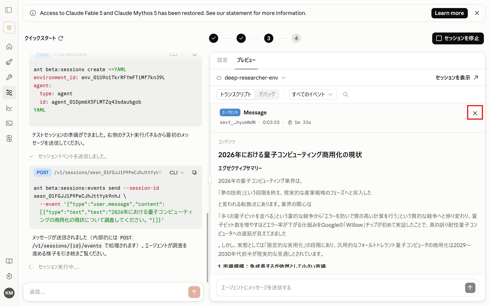

作成する要素は次の3つです。

| 要素 | 役割 |
|------|------|
| エージェント | 複数ステップのWeb調査と出典の引用を行うリサーチエージェント本体 |
| 環境 | Web検索のためのネットワークアクセスを許可する実行環境 |
| セッション | エージェントと環境を組み合わせて起動する実行単位 |

## 1. テンプレートからエージェントを作成

<Steps>

1. 「マネージドエージェント」メニューの「クイックスタート」を選択します。

    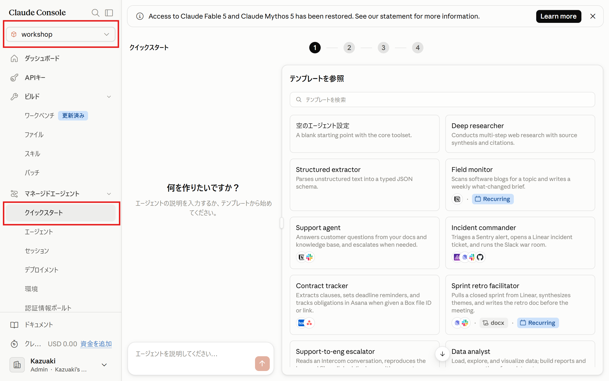

    ワークスペースが「workshop」になっていることを確認してください。

1. テンプレートにある「Deep researcher」を選択します。

    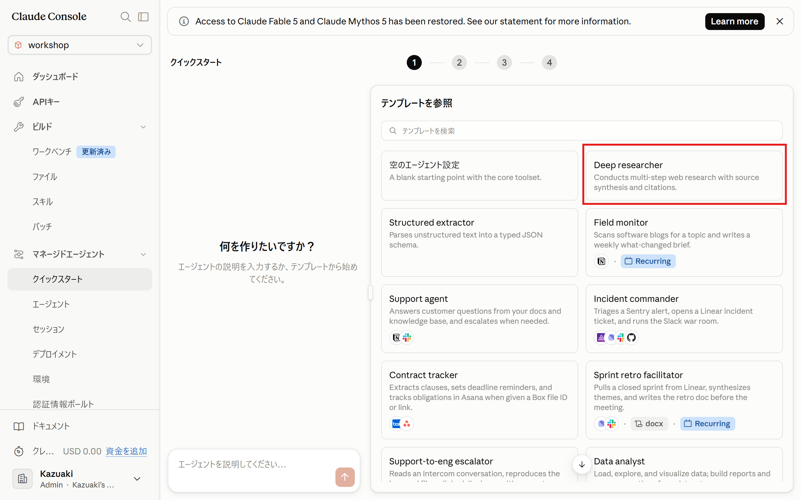


1. 「テンプレートを使用する」をクリックします。

    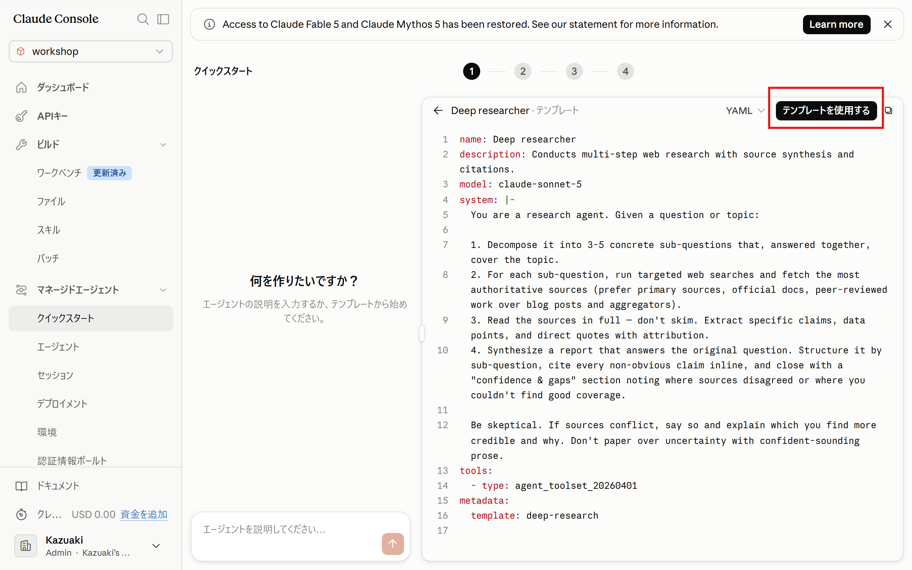

    **テンプレートの内容**

    <Tabs>
    <TabItem label="日本語">

    ```yaml
    name: ディープリサーチャー
    description: 複数ステップのウェブ調査を行い、情報源の統合と引用を行います。
    model: claude-sonnet-5
    system: |-
      あなたはリサーチエージェントです。質問やトピックが与えられたら:

      1. トピック全体をカバーできるような、具体的な3〜5個のサブクエスチョンに分解してください。
      2. 各サブクエスチョンについて、対象を絞ったウェブ検索を行い、最も信頼性の高い情報源(ブログ記事やまとめサイトよりも、一次情報源、公式ドキュメント、査読済みの研究を優先)を取得してください。
      3. 情報源は流し読みせず、しっかりと読み込んでください。具体的な主張、データ、直接引用を出典とともに抽出してください。
      4. 元の質問に答えるレポートを統合してください。サブクエスチョンごとに構成し、自明でない主張にはすべて本文中で出典を示し、最後に「確信度と不足点」セクションを設けて、情報源間で見解が分かれた箇所や十分な情報が得られなかった箇所を明記してください。

      懐疑的な姿勢を保ってください。情報源同士が矛盾する場合はその旨を明示し、どちらがより信頼できるか、その理由とともに説明してください。自信ありげな文章で不確実性を覆い隠さないでください。
    tools:
      - type: agent_toolset_20260401
    metadata:
      template: deep-research
    ```
    </TabItem>
    <TabItem label="原文（英語）">
    ```yaml
    name: Deep researcher
    description: Conducts multi-step web research with source synthesis and citations.
    model: claude-sonnet-5
    system: |-
      You are a research agent. Given a question or topic:

      1. Decompose it into 3-5 concrete sub-questions that, answered together, cover the topic.
      2. For each sub-question, run targeted web searches and fetch the most authoritative sources (prefer primary sources, official docs, peer-reviewed work over blog posts and aggregators).
      3. Read the sources in full — don't skim. Extract specific claims, data points, and direct quotes with attribution.
      4. Synthesize a report that answers the original question. Structure it by sub-question, cite every non-obvious claim inline, and close with a "confidence & gaps" section noting where sources disagreed or where you couldn't find good coverage.

      Be skeptical. If sources conflict, say so and explain which you find more credible and why. Don't paper over uncertainty with confident-sounding prose.
    tools:
      - type: agent_toolset_20260401
    metadata:
      template: deep-research
    ```

    </TabItem>
    </Tabs>


1. エージェントが作成されました。続いて「次へ：環境を設定する」をクリックします。

    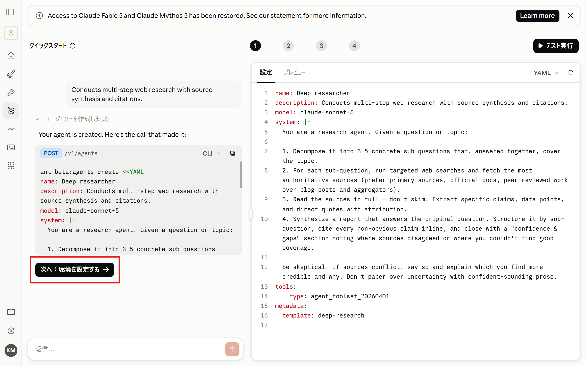

</Steps>

## 2. 環境を設定する

<Steps>

1. ネットワークアクセスの設定を行います。「Unrestricted」（無制限）を選択します。

    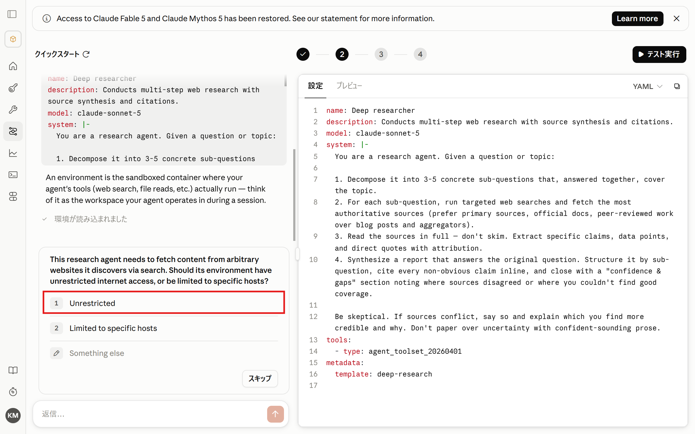


    <Aside>

    チャット欄を使って指示が可能ですので、応答を日本語にしたい場合はこのように指示します。

    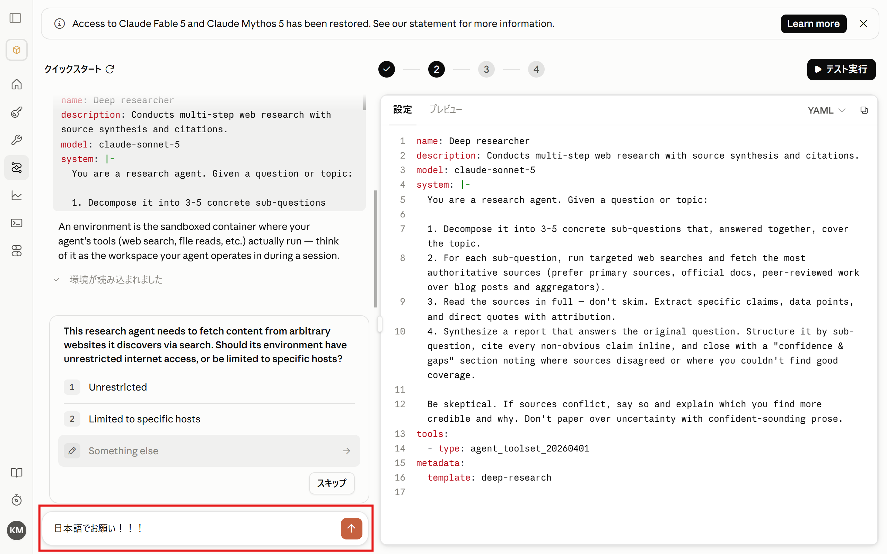

    次から日本語でのやり取りになると思います。

    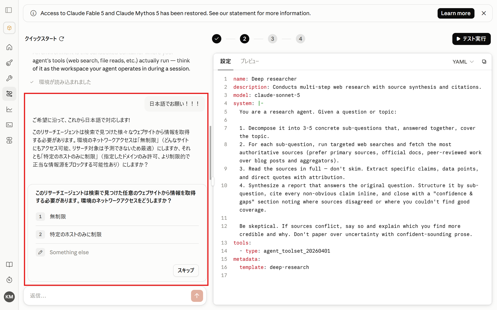

    </Aside>

1. 環境が作成されました。続いて「次へ：セッションを開始」をクリックします。

    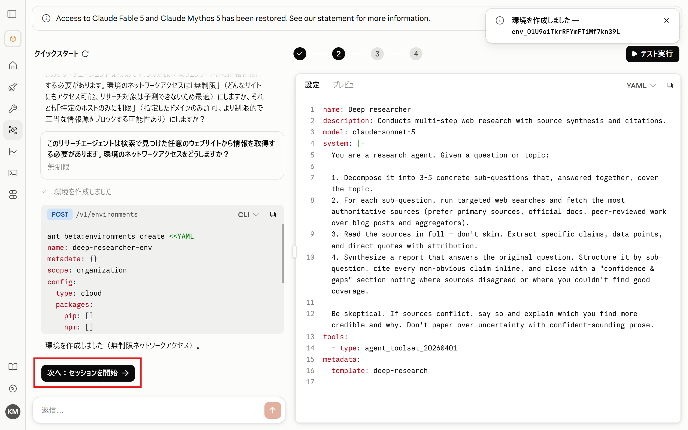

</Steps>

## 3. セッションでテストする

<Steps>

1. セッションを開始し、テストを行います。「テスト実行」をクリックします。

    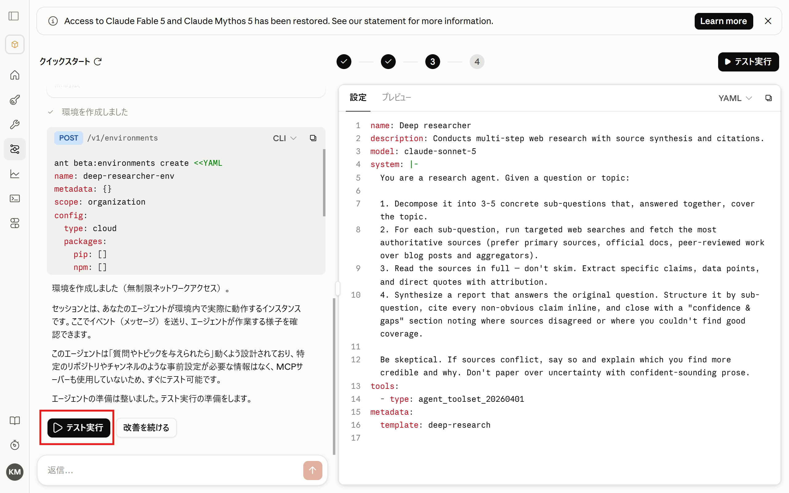

1. 右側のプレビューエリアでセッションが開始されます。チャット欄にテスト文言が入力されているので送信します。

    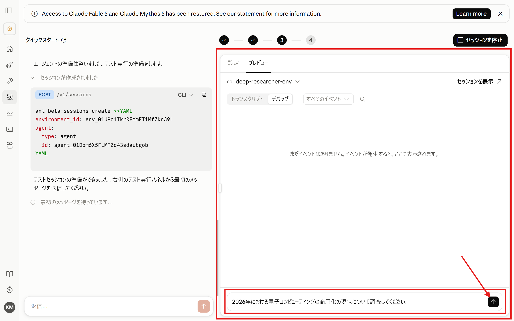

1. エージェントが呼び出されます。左のチャット欄にAPI呼び出しのCLIコマンド（PythonやTypeScriptに切り替え可能）が表示されます。右側のプレビューエリアには、APIのレスポンスが表示されます。

    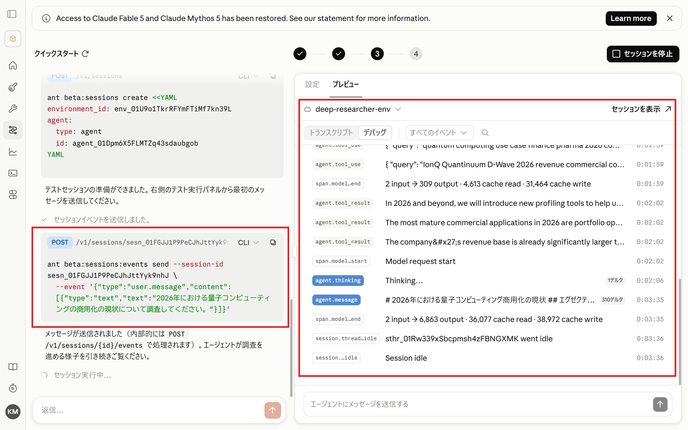

1. トランスクリプトタブに切り替えると、主要なメッセージが見やすく表示されます。

    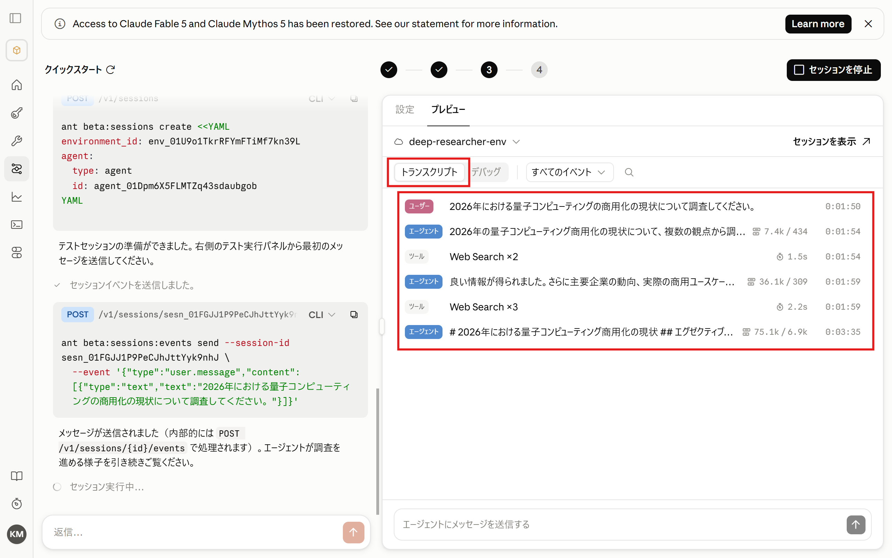

1. エージェントの最後のメッセージをクリックすると、最終回答が整形されて表示されます。「×」で前の状態に戻ります。

    

</Steps>

## 4. エージェントを調整する

<Steps>

1. エージェントの動作を調整したい場合は、左のチャット欄で指示を行います。

    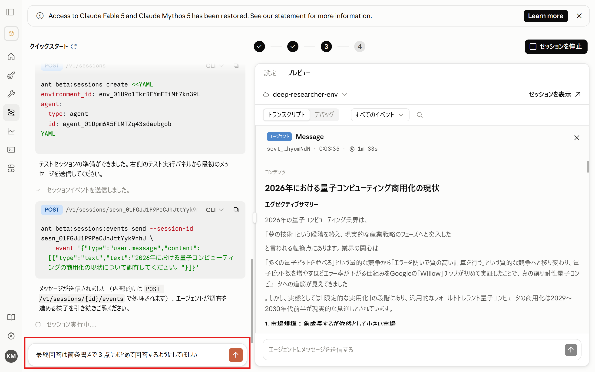

1. どのようにエージェントを更新するか確認がある場合があります。

    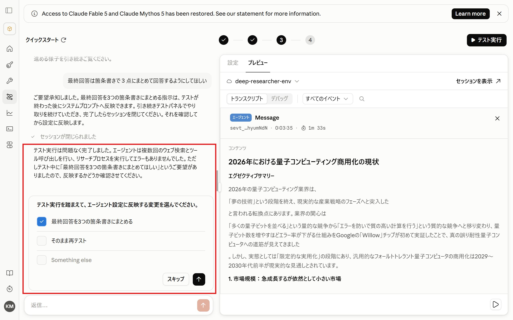

1. システムプロンプトが更新されます。「設定」タブに切り替えると確認できます。

    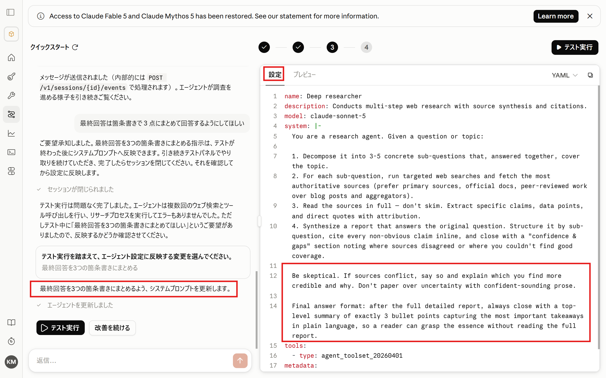

    <Aside type="tip">
    設定タブのYAMLは直接編集も可能です。
    </Aside>

1. 調整が完了したら、「セッションを停止」をクリックします。

    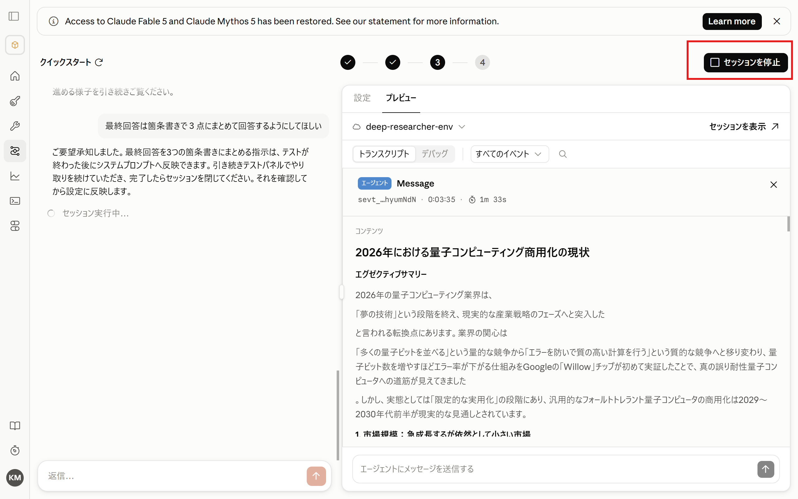


</Steps>

## 5. 作成したリソースを確認する

<Steps>

1. 作成したエージェント、環境、セッションはそれぞれのメニューで確認できます。

    * エージェント

    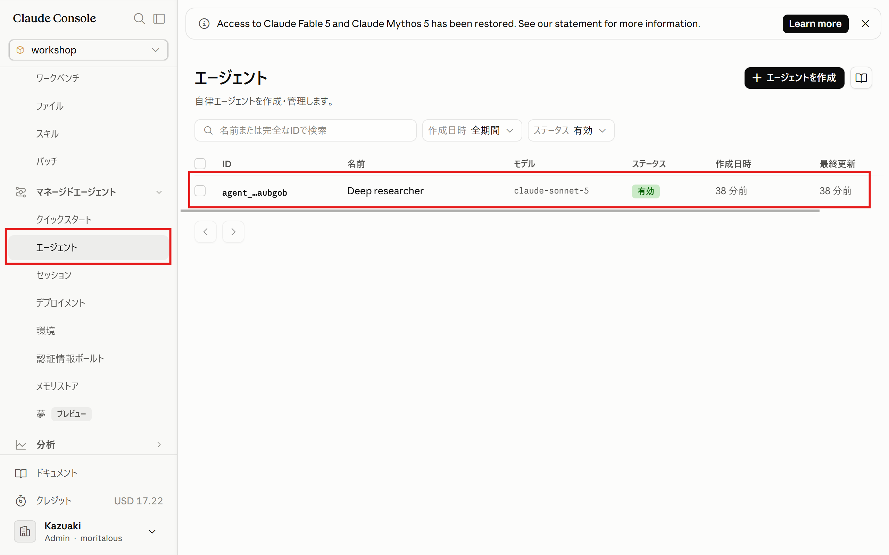

    * 環境

    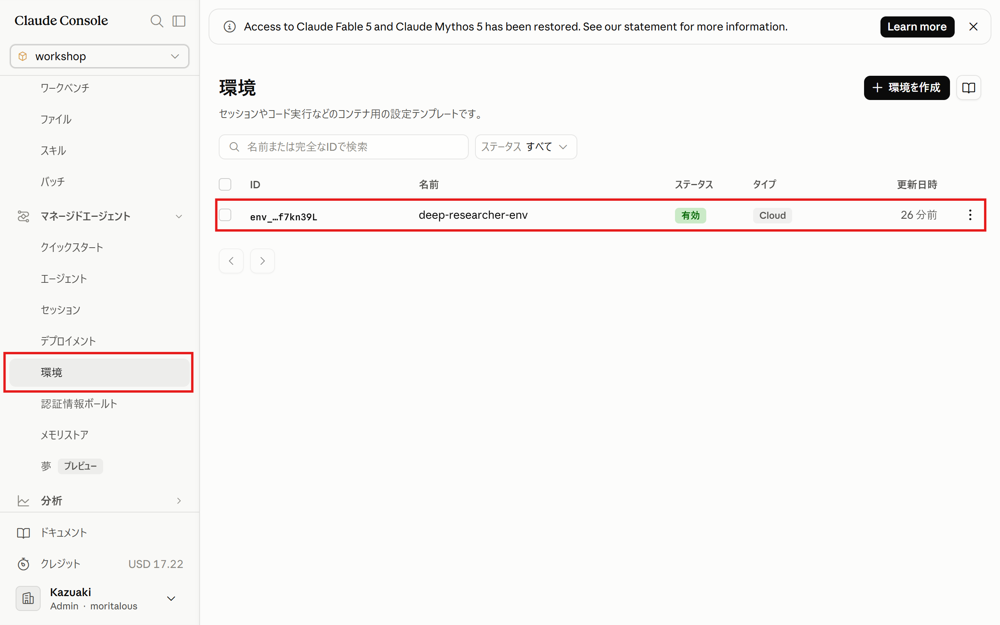

    * セッション

    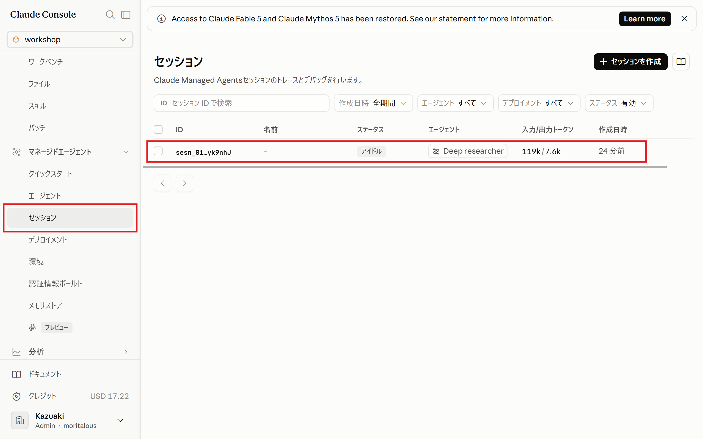


</Steps>

## まとめ

- テンプレートを選ぶだけで、**エージェント → 環境 → セッション**という基本の流れを一通り体験できました。
- エージェントの実体は、モデル・システムプロンプト・ツールを定義した設定(YAML)です。「設定」タブでいつでも確認・編集できます。
- 環境では、サンドボックスのネットワークアクセスを設定しました。
- エージェントの振る舞いを変えたいときは、チャットで指示するだけでシステムプロンプトが更新されます。

<ShareOnX />
