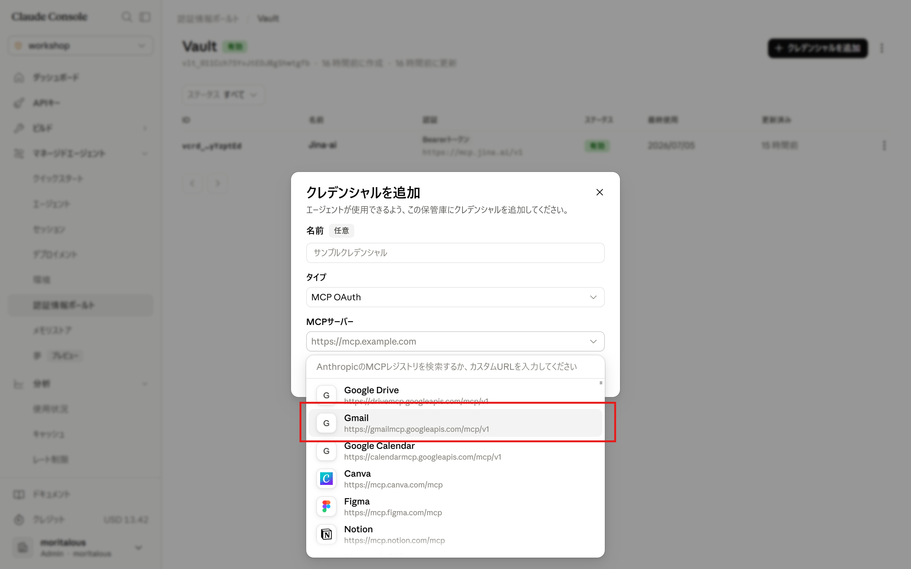
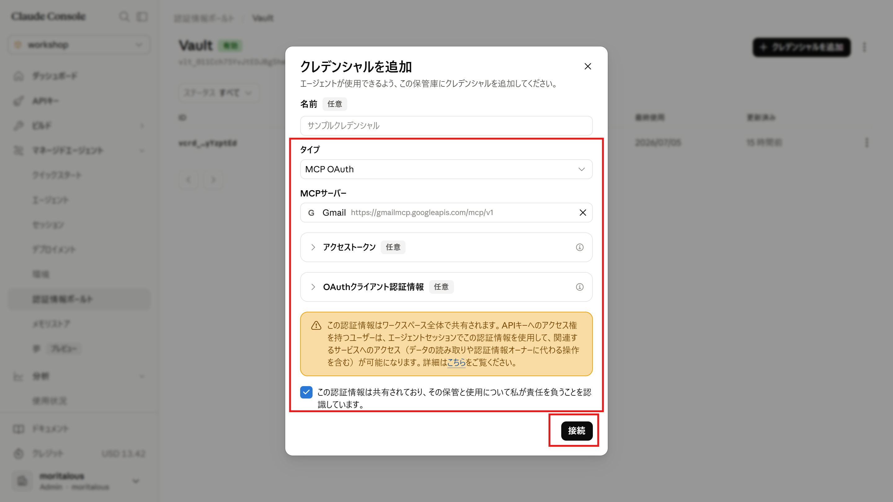

import { Steps, Tabs, TabItem, Aside } from '@astrojs/starlight/components';
import ShareOnX from '../../../../components/ShareOnX.astro';

Besides the "Bearer token" type you used in [1. Create an Agent in the Console](/en/intermediate/01_console/), credentials you add to a vault can also be of the "**MCP OAuth**" type. This type is for MCP servers that use OAuth authentication, and the console provides presets such as **Gmail** (`https://gmailmcp.googleapis.com/mcp/v1`).

On this page, you will build an agent that creates Gmail drafts for you. Along the way, you will also experience the **permission policy (`always_ask`)**, which asks the user for approval before a tool runs.

<Aside type="danger" title="Credentials are shared across the entire workspace">
Vault credentials are shared at the workspace level. Once you connect Gmail, **any session agent created with this vault attached can access your Gmail** — and anyone who holds an API key for the same workspace can create such a session. If you try this with a personal Gmail account, use a **workspace dedicated to yourself**, and archive the credential when you are done experimenting.
</Aside>

## 1. "Connect" Gmail in the Console

Unlike a Bearer token, with an MCP OAuth preset the console handles the OAuth authorization flow for you.

<Steps>

1. Open your vault under "Credential Vault" and click "Add credential".

1. Select "MCP OAuth" as the type, then choose "Gmail" from the MCP server presets.

    

1. Accept the notice and click "Connect"; Google's authorization screen opens. Choose your account and grant access.

    

    <Aside>
    The "Access token" and "OAuth client credentials" fields in the dialog are both optional. If you leave them empty, authorization goes through the OAuth app provided by Anthropic (Claude for Gmail).
    </Aside>

1. The token is stored in the vault. Anthropic also refreshes it automatically when it expires.

</Steps>

## 2. Create a Project

Create a project, move into its folder, and install the Claude SDK.

```shell
uv init gmail-agent
cd gmail-agent
uv add anthropic
```

## 3. Create the Agent

<Steps>

1. Create `setup_gmail.py` in the project folder and save the following content.

    ```python title="setup_gmail.py"
    import json

    from anthropic import Anthropic

    client = Anthropic()

    ###############################
    # 1. Find the vault that holds the Gmail credential
    ###############################
    gmail_vault_id = None
    for vault in client.beta.vaults.list():
        for cred in client.beta.vaults.credentials.list(vault_id=vault.id):
            url = getattr(cred.auth, "mcp_server_url", "") or ""
            if "gmailmcp.googleapis.com" in url:
                gmail_vault_id = vault.id
                print(f"Found Gmail credential: vault={vault.id} ({vault.display_name}) / credential={cred.id}")
                break
        if gmail_vault_id:
            break

    if not gmail_vault_id:
        raise SystemExit("Gmail credential not found. Click \"Connect\" in the console's vault first.")

    ###############################
    # 2. Create an environment (allow network access to MCP servers)
    ###############################
    environment = client.beta.environments.create(
        name="Gmail-environment",
        config={
            "type": "cloud",
            "networking": {"type": "limited", "allow_mcp_servers": True},
        },
    )
    print(f"environment: {environment.id}")

    ###############################
    # 3. Create the agent (permission policy is always_ask = require approval before execution)
    ###############################
    agent = client.beta.agents.create(
        name="Gmail Agent",
        model={"id": "claude-haiku-4-5", "speed": "standard"},
        description="An agent that searches, summarizes, and drafts Gmail messages.",
        system="You are an assistant that works with Gmail. When summarizing an email, concisely cover the sender, subject, and key points. Respond in English.",
        mcp_servers=[{"name": "gmail", "type": "url", "url": "https://gmailmcp.googleapis.com/mcp/v1"}],
        tools=[
            {
                "type": "mcp_toolset",
                "mcp_server_name": "gmail",
                "default_config": {
                    "enabled": True,
                    "permission_policy": {"type": "always_ask"},
                },
            }
        ],
    )
    print(f"agent:       {agent.id}")

    with open("ids_gmail.json", "w") as f:
        json.dump(
            {
                "vault_id": gmail_vault_id,
                "environment_id": environment.id,
                "agent_id": agent.id,
            },
            f,
            indent=2,
        )
    print("Saved IDs to ids_gmail.json")
    ```

    There are two key points here.

    - **Automatic vault discovery** — the script lists vaults and their credentials, looking for a vault that contains a credential with the Gmail MCP server URL. This shows that a credential created from the console in step 1 can be referenced from code just like any other credential
    - **`permission_policy: always_ask`** — unlike the `always_allow` we used so far, this setting makes the session **pause and ask for approval** before the agent runs a tool. Since we are dealing with real email data, we err on the side of safety

1. Run the script.

    ```shell
    uv run setup_gmail.py
    ```

    ```text
    Found Gmail credential: vault=vlt_011Cch75YvJtEDJBgShwtgfb (Vault) / credential=vcrd_01Cwkza...
    environment: env_01RcwVQvCdgfidJqSN32Ypua
    agent:       agent_01Rs4ReLgJkee8xkX18Mdxpp
    Saved IDs to ids_gmail.json
    ```

</Steps>

## 4. Talk to the Agent

<Steps>

1. Create `run_gmail.py` in the project folder and save the following content.

    ```python title="run_gmail.py"
    import json

    from anthropic import Anthropic

    client = Anthropic()

    with open("ids_gmail.json") as f:
        ids = json.load(f)

    ###############################
    # 1. Create a session (combine the agent, environment, and Gmail vault)
    ###############################
    session = client.beta.sessions.create(
        agent=ids["agent_id"],
        environment_id=ids["environment_id"],
        vault_ids=[ids["vault_id"]],
    )
    print(f"session: {session.id}")
    print("Chatting with the agent. Type exit to quit.\n")


    ###############################
    # 2. Send and receive one turn (confirm with y/N when approval is required)
    ###############################
    def run_turn(text: str) -> None:
        pending_tools = {}  # event_id -> (tool name, arguments)

        # Open the stream before sending the message
        stream = client.beta.sessions.events.stream(session_id=session.id)
        client.beta.sessions.events.send(
            session.id,
            events=[{"type": "user.message", "content": [{"type": "text", "text": text}]}],
        )

        for event in stream:
            if event.type == "agent.mcp_tool_use":
                if getattr(event, "evaluated_permission", None) == "ask":
                    # This tool call needs approval. Remember its ID
                    pending_tools[event.id] = (event.name, event.input)
                else:
                    print(f"[tool: {event.name}]")
            elif event.type == "agent.message":
                for block in event.content:
                    if block.type == "text":
                        print(block.text)
            elif event.type == "session.status_idle":
                if event.stop_reason.type == "requires_action":
                    # Waiting for approval. Show the tool call and ask the user
                    for event_id in event.stop_reason.event_ids:
                        name, tool_input = pending_tools.get(event_id, ("(unknown)", {}))
                        print("\n----- Approval request -----")
                        print(f"Tool:      {name}")
                        print(f"Arguments: {json.dumps(tool_input, ensure_ascii=False, indent=2)}")
                        answer = input("Allow this call? [y/N] ").strip().lower()
                        confirmation = {
                            "type": "user.tool_confirmation",
                            "tool_use_id": event_id,
                            "result": "allow" if answer == "y" else "deny",
                        }
                        if answer != "y":
                            confirmation["deny_message"] = "The user denied this call."
                        client.beta.sessions.events.send(session.id, events=[confirmation])
                        print("Response sent. Continuing...\n")
                else:
                    break
            elif event.type == "session.status_terminated":
                print("The session has terminated.")
                raise SystemExit(1)
        stream.close()


    ###############################
    # 3. Send the first task, then keep the conversation going
    ###############################
    run_turn(
        "Create a Gmail draft addressed to myself with the subject \"Checking tomorrow's schedule\". "
        "Keep the body short — I'll leave the wording to you. Do not send it. "
        "If anything is unclear, such as the recipient's email address, ask me."
    )

    while True:
        user_input = input("\nYou> ").strip()
        if user_input == "exit":
            break
        if not user_input:
            continue
        run_turn(user_input)

    print("\nDone")
    ```

    <Aside>
    Tool calls under `always_ask` arrive as `agent.mcp_tool_use` events carrying `evaluated_permission: "ask"`, and the session waits in an idle state whose `stop_reason` is `requires_action`. You resume it by sending a `user.tool_confirmation` event (`result` is `allow`/`deny`; attaching a `deny_message` conveys the reason to the agent). The value you pass as `tool_use_id` is the **ID of the tool-call event** (it starts with `sevt_`).
    </Aside>

1. Run the script. When the agent asks you a question, answer at the `You>` prompt; when an approval request appears, **inspect the arguments first**, then allow it with `y`.

    ```shell
    uv run run_gmail.py
    ```

    ```text
    session: sesn_01WCk8w6uAJPuoP7QG32G4tr
    Chatting with the agent. Type exit to quit.

    I'd be happy to create the draft, but there's one thing I need to confirm:

    **Could you tell me your email address?**

    You> your email address

    ----- Approval request -----
    Tool:      create_draft
    Arguments: {
      "body": "Hi,\n\nI have a few things I'd like to confirm about tomorrow's schedule. ...",
      "subject": "Checking tomorrow's schedule",
      "to": [
        "your email address"
      ]
    }
    Allow this call? [y/N] y
    Response sent. Continuing...

    Done! I've created the email draft titled "Checking tomorrow's schedule".

    You> exit
    ```

1. Open Gmail's "Drafts" folder and you will find the draft the agent created. You can confirm it has the same subject and body that were shown in the approval request.

</Steps>

<Aside type="tip">
Answering `N` (deny) to the approval request is also an interesting experiment. The denial reason (`deny_message`) is conveyed to the agent, and you can watch the agent change its approach.
</Aside>

## Summary

- The vault's "MCP OAuth" type comes with **presets such as Gmail**, and the console's "Connect" button handles OAuth authorization plus token storage and refresh for you.
- Credentials created in the console can be referenced from code just like any other credential (a natural division of labor: create OAuth credentials by clicking "Connect" in the console, then reference them from code by vault ID).
- With `always_ask`, each tool execution involves a round trip: `agent.mcp_tool_use` (awaiting approval) → `user.tool_confirmation` (allow/deny). You get to **inspect the payload before it runs** for operations that touch real data.
- When handling credentials for a personal account like Gmail, keep the **workspace-wide sharing** behavior in mind.

<ShareOnX />
