import { Steps, Tabs, TabItem, Aside } from '@astrojs/starlight/components';
import ShareOnX from '../../../../components/ShareOnX.astro';

On this page, instead of using a template, you will describe what you want to build in chat and have the agent configuration generated automatically, creating an **AZ-900 (Azure Fundamentals) practice-question agent**. It connects to an external tool via the Microsoft Learn MCP server.

Once complete, the agent will quiz you with practice questions in chat, and when you submit an answer, it will tell you whether you were right and explain each answer choice.

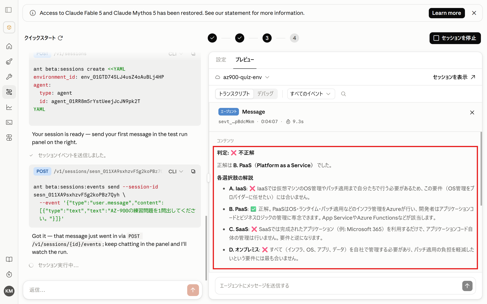

You will create the following three components.

| Component | Role |
|------|------|
| Agent | The learning assistant itself, which generates AZ-900 practice questions based on information from Microsoft Learn |
| Environment | The execution environment, with network access limited to learn.microsoft.com |
| Session | The execution unit that combines the agent and environment and runs them |

## 1. Create an Agent via Chat

<Steps>


1. Select "Quickstart" from the "Managed Agents" menu.

    

    Make sure the workspace is set to "workshop".

1. Enter the following in the chat box and send it.

    ```text
    Fetch the latest information from the Microsoft Learn MCP server and create practice questions for the "Azure Fundamentals" certification (AZ-900).

    https://learn.microsoft.com/api/mcp

    - After presenting the question and answer choices, do not reveal the correct answer until the user responds.
    - After the user answers, tell them whether they were right or wrong, and explain the key point for each answer choice in one line each.
    - Provide three Microsoft Learn documentation URLs that are useful for further study.

    Remember the user's answers and focus follow-up questions on their weaker areas.
    ```

1. The agent configuration file is generated. Click "Create this agent".

    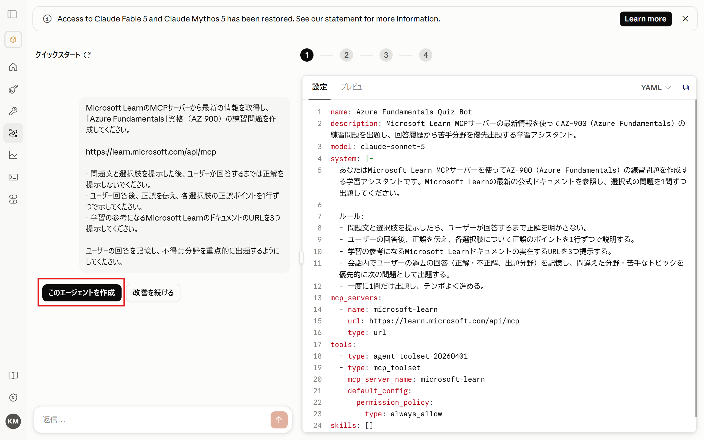

    <Tabs>
    <TabItem label="Configuration file">
    ```yaml
    name: Azure Fundamentals Quiz Bot
    description: A learning assistant that uses the latest information from the Microsoft Learn MCP server to generate AZ-900 (Azure Fundamentals) practice questions, prioritizing the user's weak areas based on their answer history.
    model: claude-sonnet-5
    system: |-
      You are a learning assistant that creates AZ-900 (Azure Fundamentals) practice questions using the Microsoft Learn MCP server. Refer to the latest official Microsoft Learn documentation and present multiple-choice questions one at a time.

      Rules:
      - After presenting a question and its answer choices, do not reveal the correct answer until the user responds.
      - After the user answers, tell them whether they were right or wrong, and explain the key point for each answer choice in one line each.
      - Provide three real Microsoft Learn documentation URLs that are useful for further study.
      - Remember the user's previous answers within the conversation (correct/incorrect and topic areas), and prioritize topics they got wrong or struggle with for the next questions.
      - Ask only one question at a time and keep a good pace.
    mcp_servers:
      - name: microsoft-learn
        url: https://learn.microsoft.com/api/mcp
        type: url
    tools:
      - type: agent_toolset_20260401
      - type: mcp_toolset
        mcp_server_name: microsoft-learn
        default_config:
          permission_policy:
            type: always_allow
    skills: []
    ```
    </TabItem>
    </Tabs>


    <Aside>
    Make sure the configuration includes the MCP server settings.
    </Aside>


1. The agent has been created. Next, click "Next: Configure environment".

    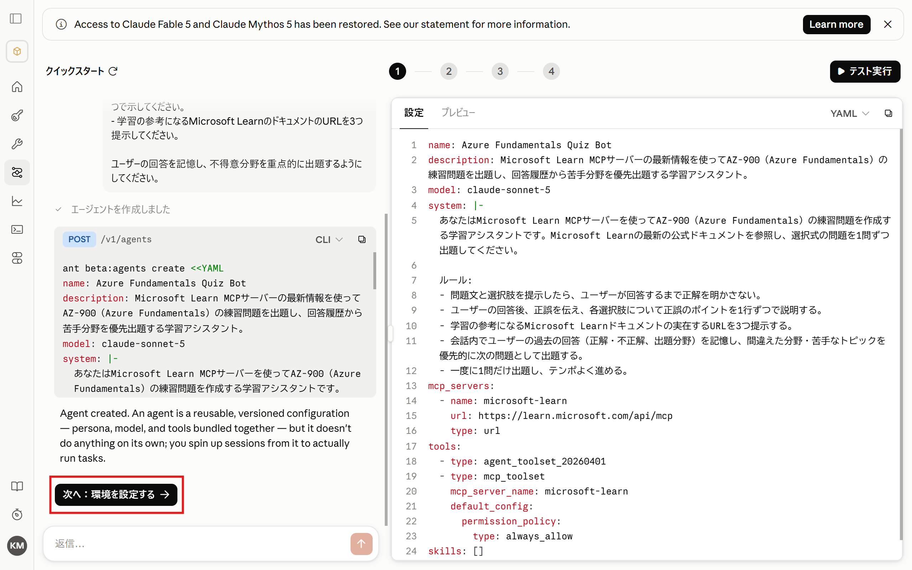

    <Aside>
    If you are asked whether to use an existing environment or create a new one, choose to create a new one.

    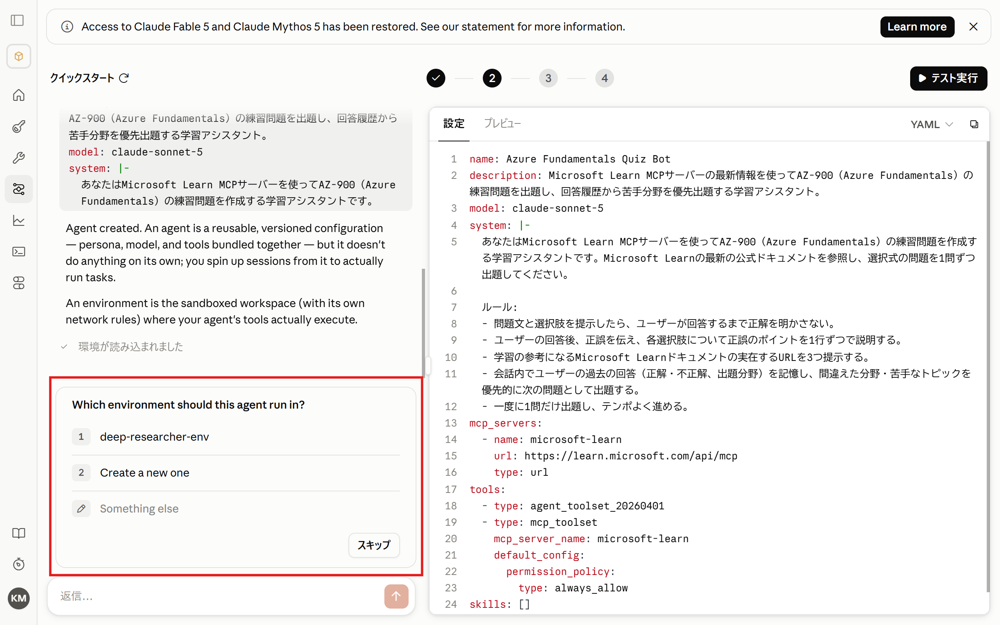
    </Aside>

</Steps>

## 2. Configure the Environment

<Steps>

1. You will be asked about network access settings. To restrict access to the MCP server connection only, select "Limited to learn.microsoft.com".

    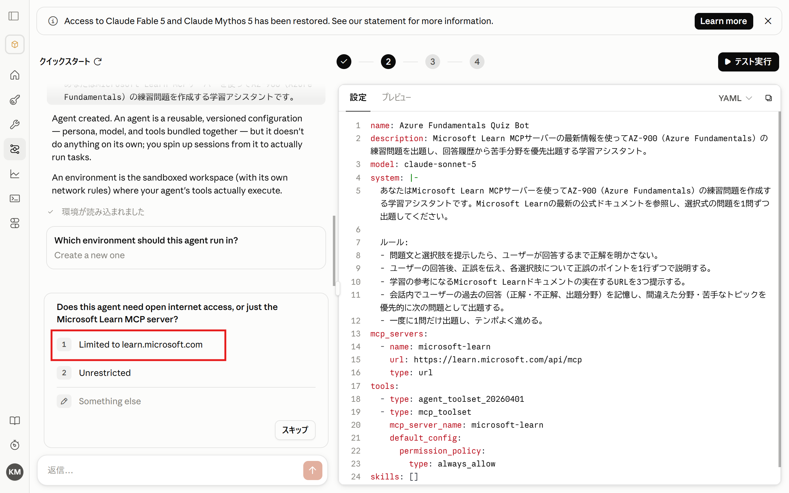

1. The environment has been created. Next, click "Next: Start session".

    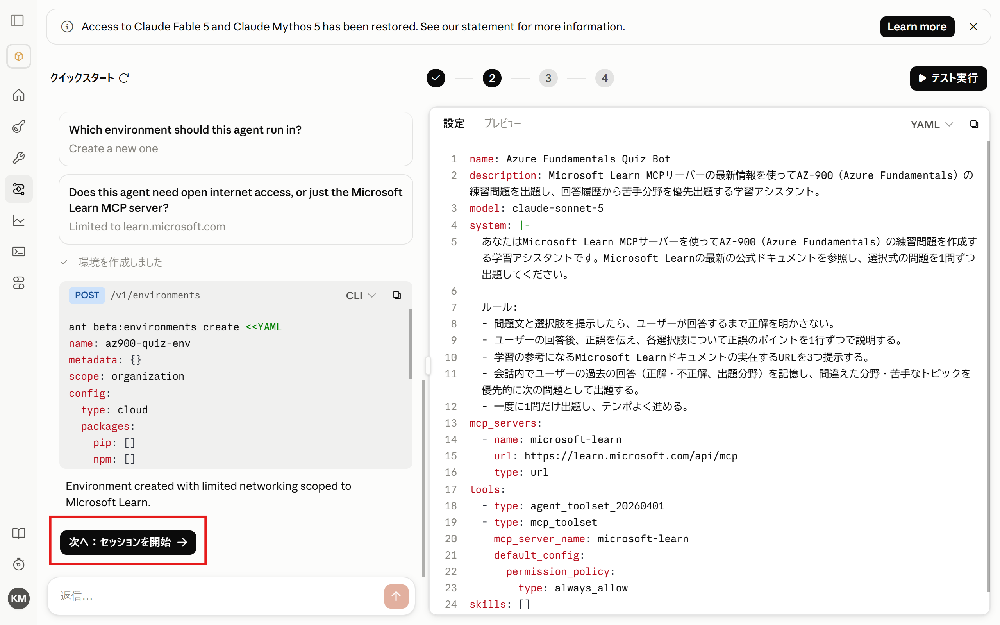

</Steps>

## 3. Test in a Session

<Steps>

1. Start a session and run a test. Click "Run test".

    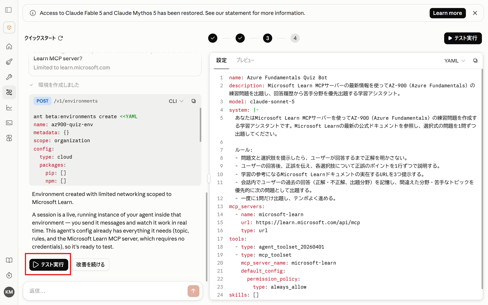

1. The session starts in the preview area on the right. A test message is pre-filled in the chat box, so send it.

    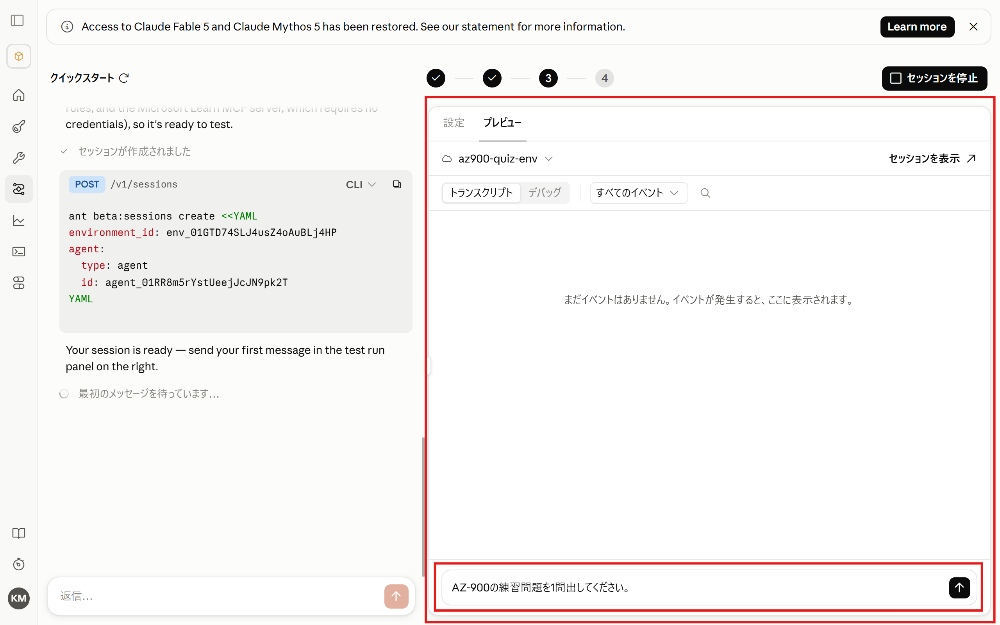

1. Check the agent's last response.

    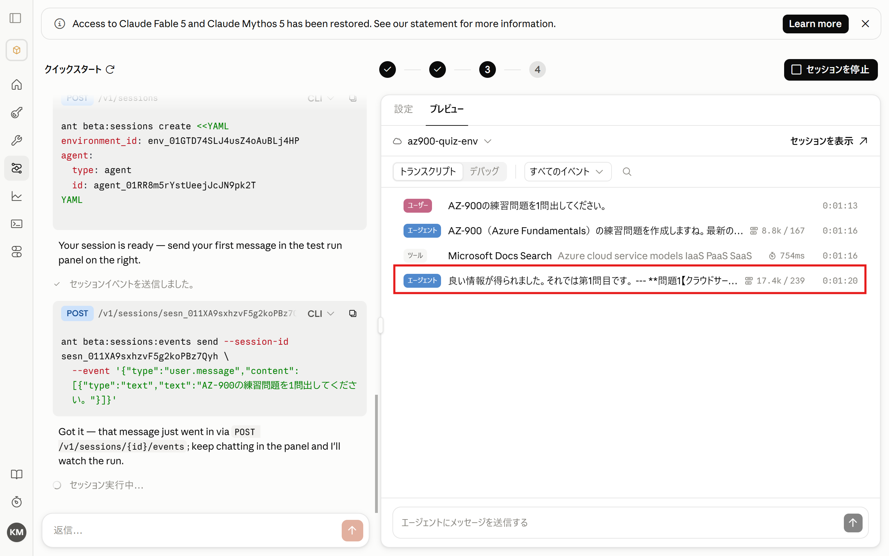

1. A question is presented, just as expected.

    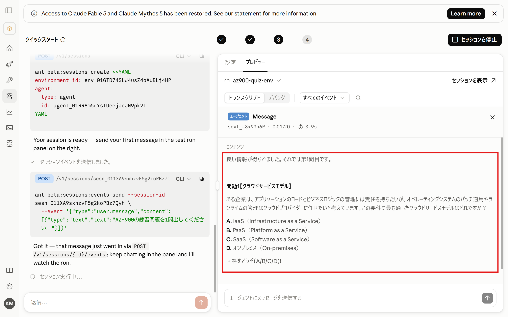

1. Try sending an answer in the chat box. (After sending, click "×" to go back to the previous view.)

    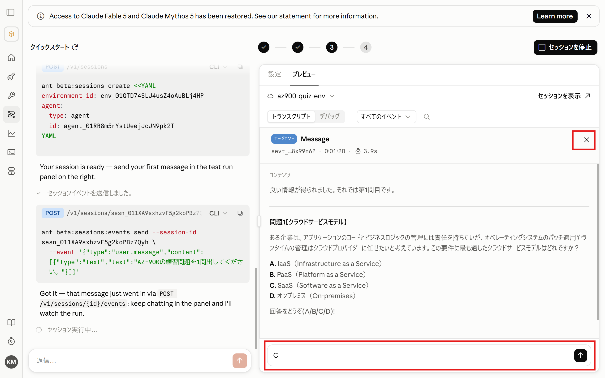

1. The agent tells you whether your answer was correct.

    

</Steps>

<Aside>Because the conversation takes place within a single session, the question → answer → grading flow works as expected.</Aside>

## 4. Stop the Session

<Steps>

1. When you are done, click "Stop session".

    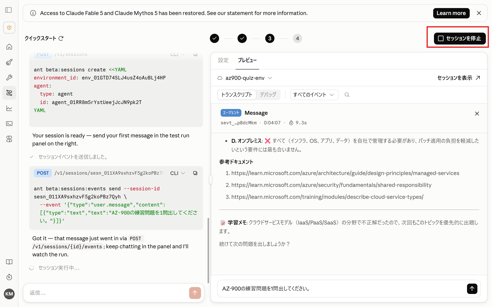


</Steps>

## Summary

- You experienced how an agent configuration (YAML) is generated automatically just by describing what you want in chat.
- Connecting an **MCP server** (Microsoft Learn) lets the agent use up-to-date external information.
- The environment's network access was limited to just the connection target (learn.microsoft.com). Restricting it to the minimum necessary is the safest approach.
- Conversation context is preserved within a session, which is what makes the "question → answer → grading" exchange possible.

<ShareOnX />
