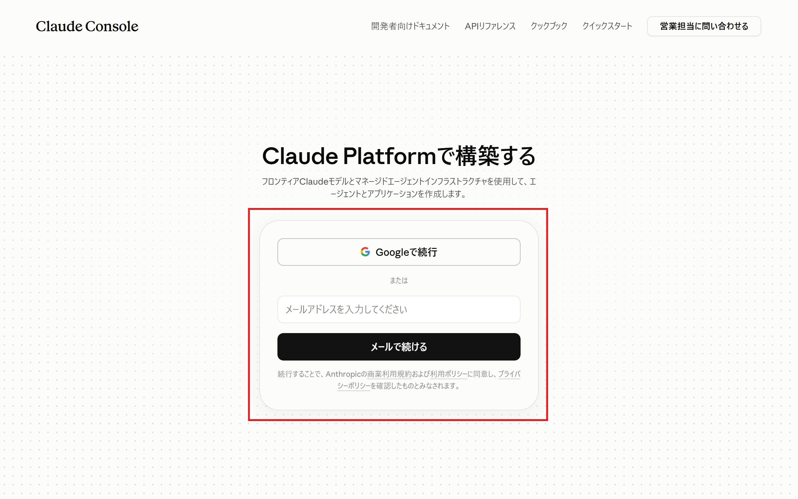
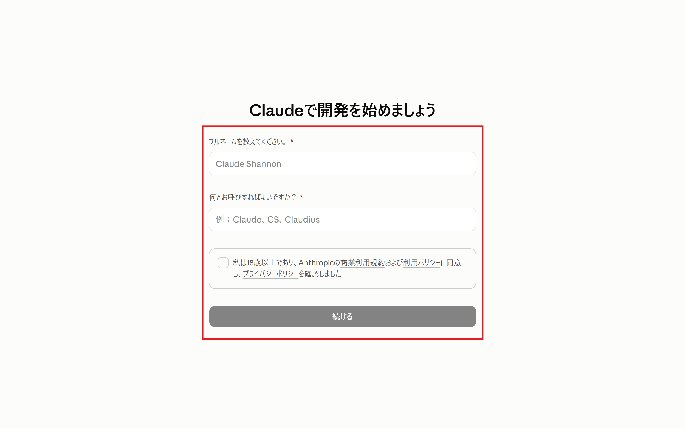
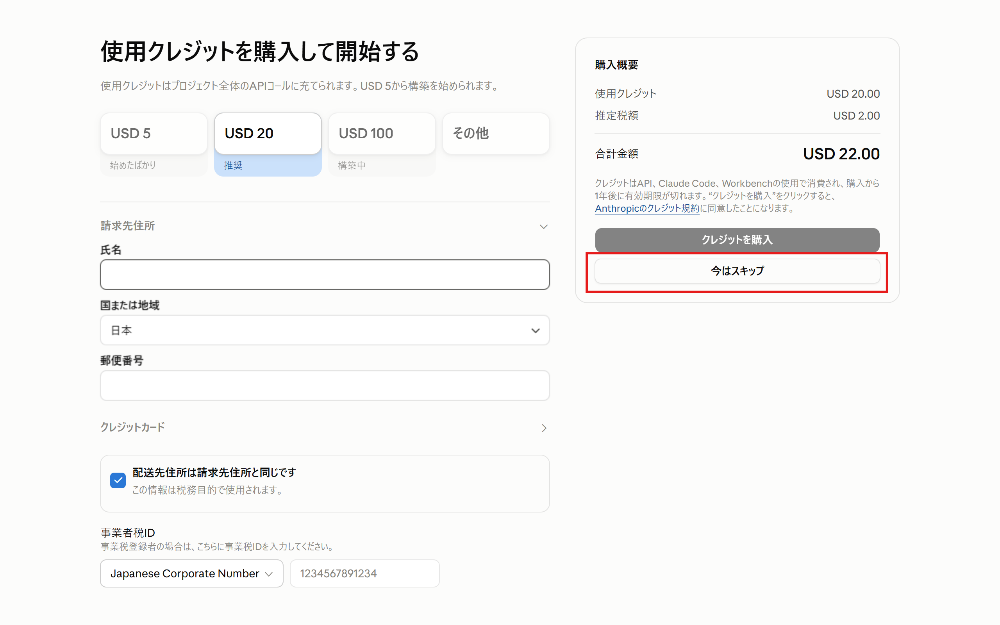
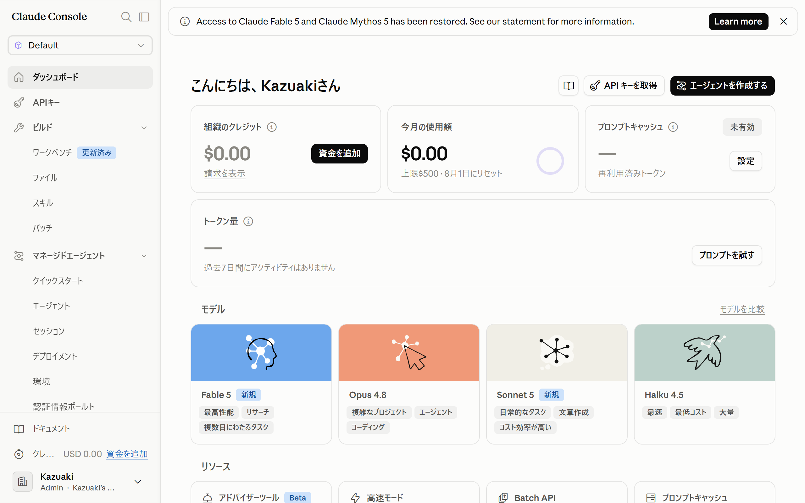
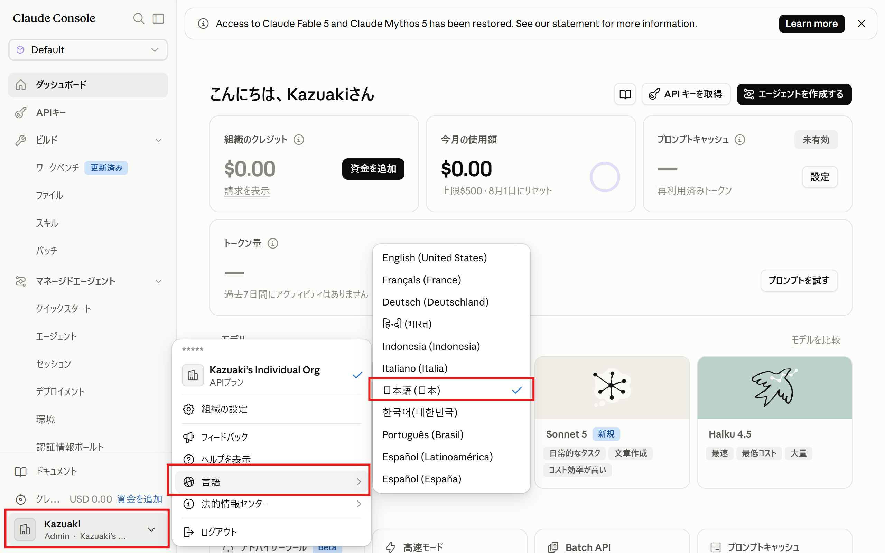
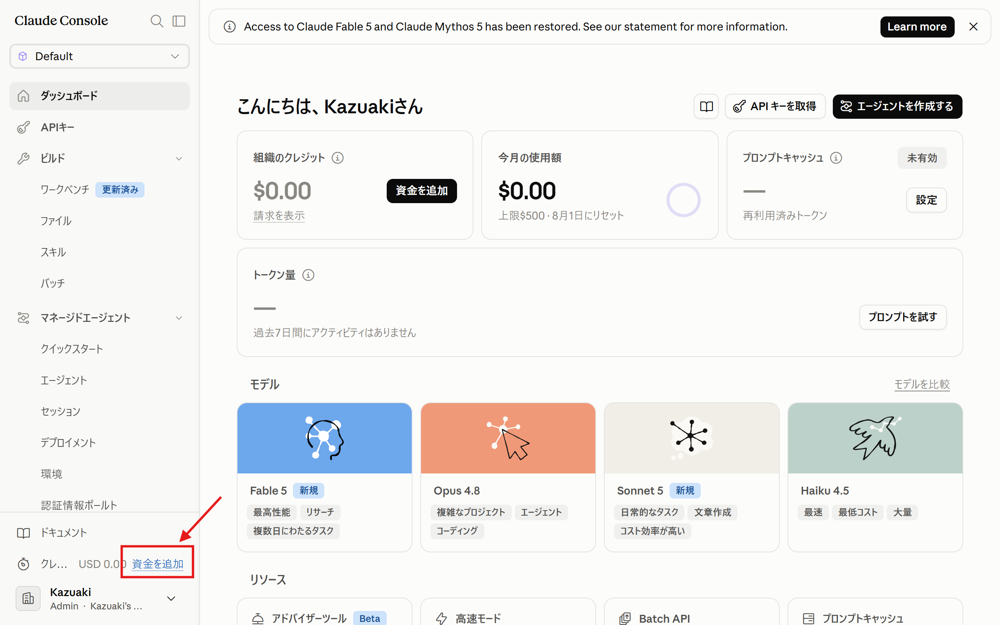
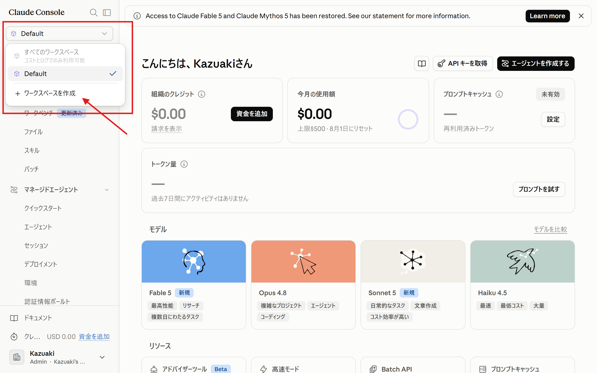
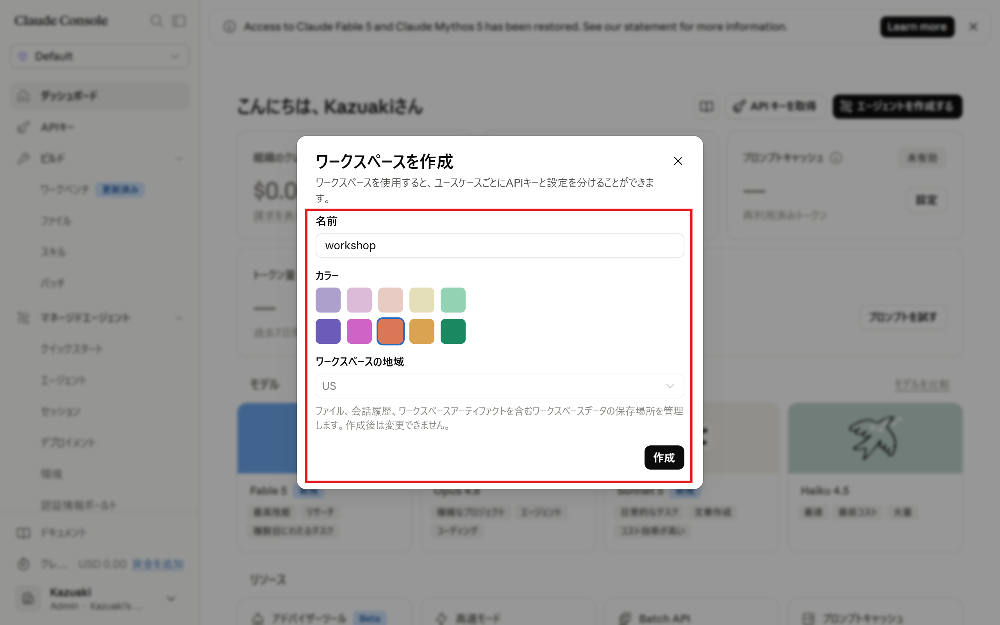
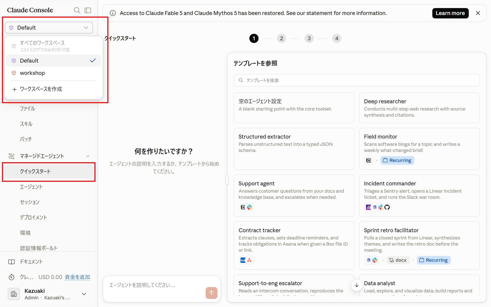

import { Steps, Tabs, TabItem, Aside } from '@astrojs/starlight/components';

First, complete the following preparation steps.

## 1. Create a Claude Platform Account

<Steps>

1. Go to [platform.claude.com](https://platform.claude.com) and create an account. You can sign up with a Google account or an email address.

    

2. Enter your name and other details.

    

3. Select "Skip for now".

    

4. Your account has been created.

    

5. You can change the display language here.

    

</Steps>

<Aside type="note" title="This is separate from your claude.ai account">
A subscription account for the chat service [claude.ai](https://claude.ai) (including Pro/Max plans) cannot be used to access the API. You need a **Claude Platform** account, which is for developers.
</Aside>

## 2. How to Purchase API Credits

Managed Agents is used via the API, so you need API credits (a prepaid usage balance).

<Aside type="tip">
API credits will be distributed at the event. Purchasing them in advance is not required.
</Aside>

<Steps>

1. Click "Add funds" at the bottom left of the screen

    

2. Register a credit card and purchase credits

</Steps>

<Aside type="tip" title="Estimated cost for the hands-on">
Running through the entire workshop costs **roughly $5–10** (this varies depending on how much trial and error you do and the nature of the tasks). We mainly use `claude-haiku-4-5` (beginner and intermediate) and `claude-sonnet-5` (advanced).
</Aside>

## 3. Create a Workspace

Create a workspace.

<Steps>

1. Click the workspace selector at the top left of the screen, then click "Create workspace"

    

1. Enter a name and color, then click "Create"

    

</Steps>

<Aside>
The dashboard screen is fixed to the `Default` workspace, so switch workspaces after navigating to another menu such as "Quickstart"

</Aside>

## 4. Prepare an Editor

From the intermediate section onward, you will edit code and configuration files. Any editor you normally use is fine. If you have no particular preference, we recommend [Visual Studio Code](https://code.visualstudio.com/).
