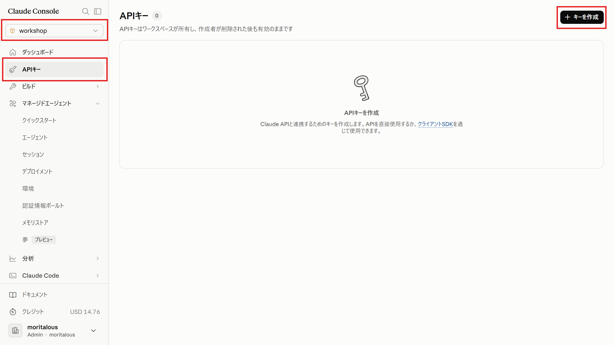
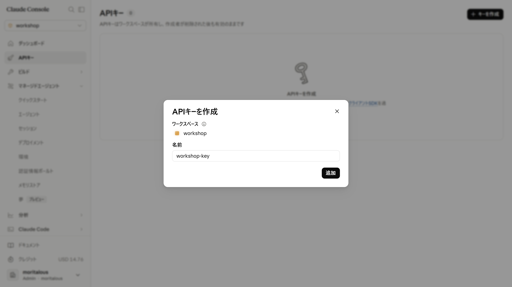

import { Steps, Tabs, TabItem, Aside } from '@astrojs/starlight/components';

In the CLI and SDK steps up to this page, we authenticated using the login credentials from `ant auth login`. No API key was issued. This page explains how authentication works and how to issue and configure an API key when you need one.

## No API Key Needed If You Are Logged In via the CLI

The `ant` CLI and the `anthropic` package (SDK) look for credentials in the following order of precedence:

1. The `ANTHROPIC_API_KEY` environment variable
2. The `ANTHROPIC_AUTH_TOKEN` environment variable
3. **The login credentials saved by `ant auth login`** (`%APPDATA%\Anthropic` on Windows, `~/.config/anthropic/` on macOS)

Therefore, on a machine where you have already run `ant auth login`, both the CLI and an SDK client created with a no-argument `Anthropic()` work as-is with no extra configuration. Token expiration is also refreshed automatically.

If you are unsure which credentials are being used, you can check with the following command.

<Tabs syncKey="os">

<TabItem label="Windows">
```shell
./ant auth status
```
</TabItem>

<TabItem label="macOS">
```shell
ant auth status
```
</TabItem>

</Tabs>

<Aside type="caution">
Environment variables take **precedence** over login credentials. If a stale `ANTHROPIC_API_KEY` is left in your environment variables (even an empty string), it will be used instead—so delete the environment variable if you want to authenticate with your login credentials.
</Aside>

## When You Need an API Key

Use an API key instead of login credentials in situations like these:

- Running in environments where browser-based login is not possible, such as CI or servers
- Using only the SDK on a machine where `ant` is not installed
- Embedding into an application shared by your team

## Issue an API Key

<Steps>

1. Select the "API keys" menu in the Console and click "Create key".

    

    <Aside>
    Make sure the workspace is set to "workshop". API keys are issued per workspace and can only access that workspace's resources.
    </Aside>

1. Enter a name and click "Add". Note down the displayed API key (a string starting with `sk-ant-`).

    

</Steps>

## Use the API Key

Set it in the `ANTHROPIC_API_KEY` environment variable, and both the CLI and the SDK will use it automatically.

<Tabs syncKey="os">

<TabItem label="Windows">
```shell
$env:ANTHROPIC_API_KEY = "YOUR_API_KEY_HERE"
```
</TabItem>

<TabItem label="macOS">
```shell
export ANTHROPIC_API_KEY="YOUR_API_KEY_HERE"
```
</TabItem>

</Tabs>

<Aside type="caution">
This setting disappears when you close the window. To make it persistent, use "Edit environment variables" on Windows, or append it to `~/.zshrc` on macOS. Avoid hard-coding the API key directly in your script's source code.
</Aside>
