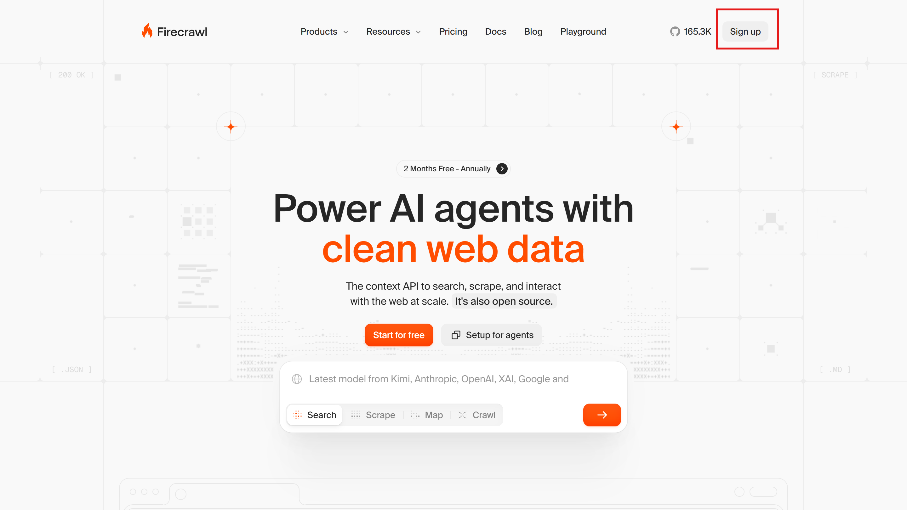
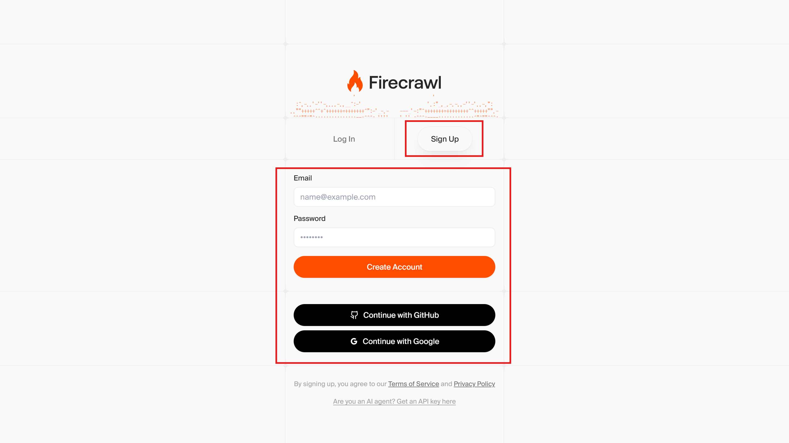
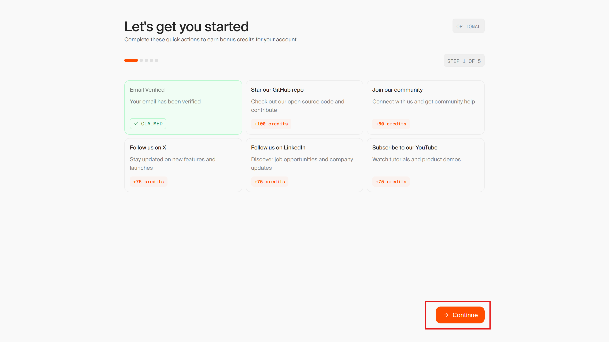
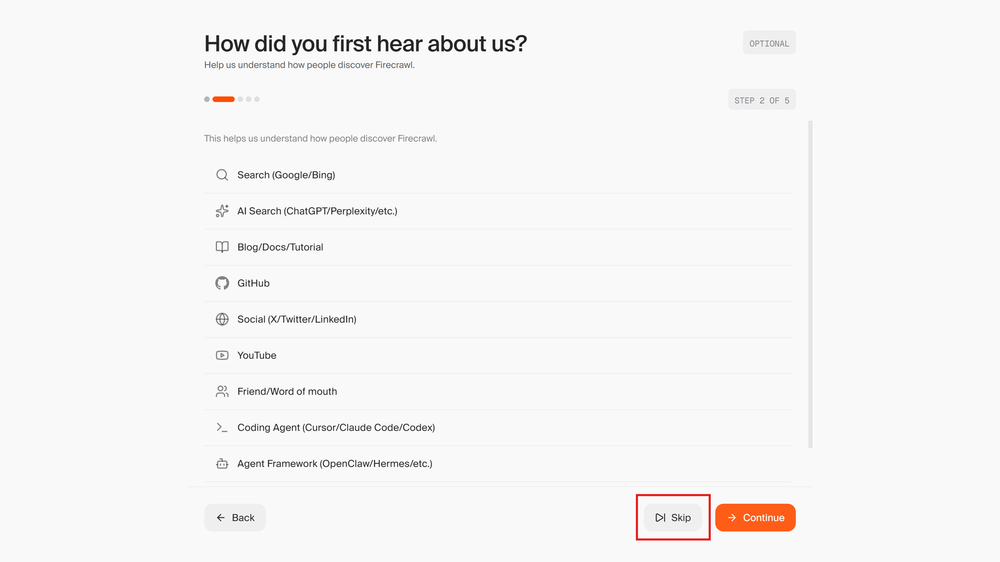
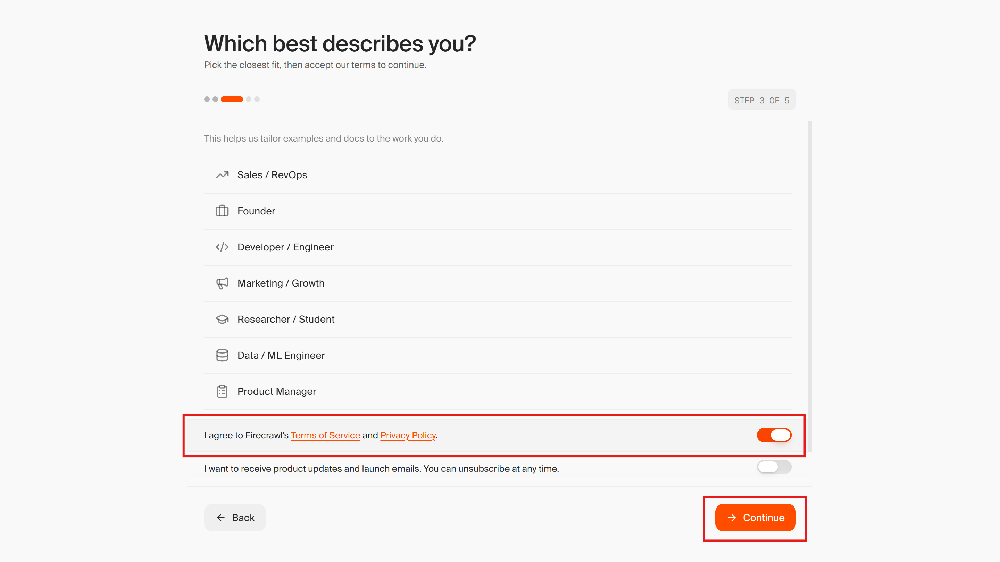
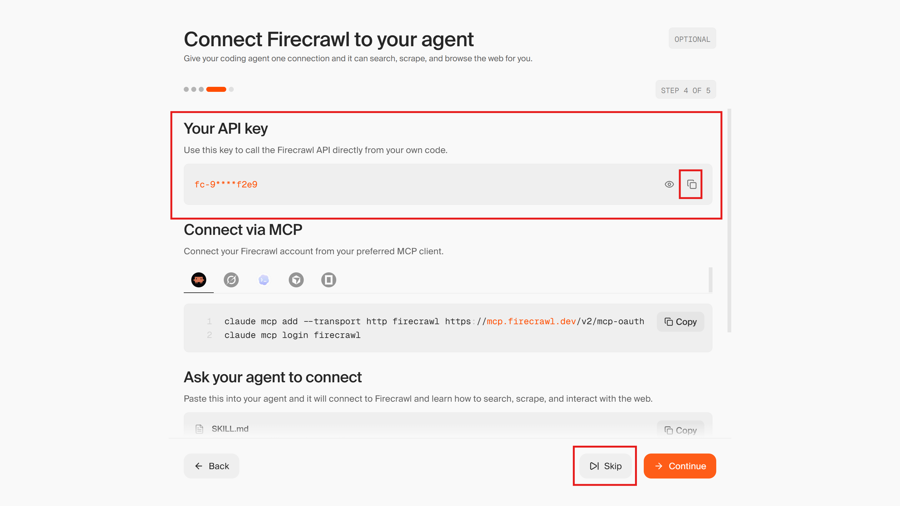
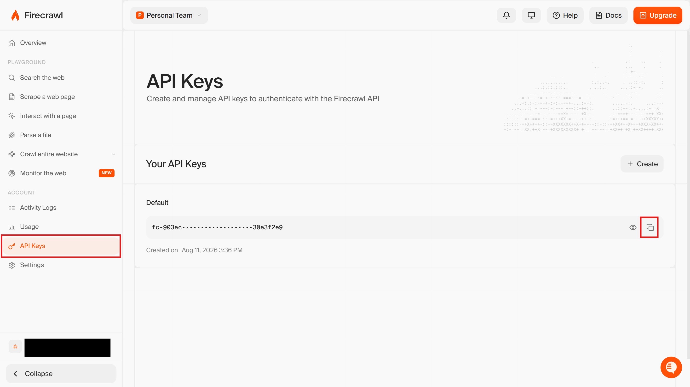

import { Steps, Aside } from '@astrojs/starlight/components';

If you get stuck, ask the people around you or ask Claude Code!

:::note
Of course, you are also welcome to ask the event staff!
:::

## Jina AI is unavailable due to quota limits

**Symptom**: From [1. Create an Agent in the Console](/en/intermediate/01_console/) onward, the agent's Jina AI tool calls fail. This happens when you have used up the free token allowance or hit a rate limit.

**Fix**: Use the [Firecrawl](https://www.firecrawl.dev/) MCP server instead of Jina AI. Firecrawl also connects via "Bearer token + custom URL", so **once you have a Firecrawl API key, you only need to substitute three things in the material**.

### Sign up for Firecrawl and get an API key

<Steps>

1. Open https://www.firecrawl.dev/ and click "Sign up".

    

1. Make sure the "Sign Up" tab is selected, then create an account using whichever method you prefer.

    

1. Work through the wizard.

    

    

1. Review the terms of service and tick the checkbox.

    

1. Copy the API key.

    

    <Aside>
    If you miss the chance to copy the API key during the wizard, you can always find it again from the "API Keys" menu.

    
    </Aside>

</Steps>

### The three substitutions

| Item | Jina AI | Firecrawl |
|------|---------|-----------|
| Where to get the API key | https://jina.ai/ | https://www.firecrawl.dev/ |
| MCP server URL | `https://mcp.jina.ai/v1` | `https://mcp.firecrawl.dev/v2/mcp` |
| Tool names | `search_web` / `read_url` / `search_arxiv`, etc. | `firecrawl_search` / `firecrawl_scrape` / `firecrawl_parse` / `firecrawl_map` / `firecrawl_crawl` |

The credential type in the vault (**Bearer token**), the environment setting (**Allow network access to MCP servers**), and the way you create a session are all exactly the same as with Jina AI.

### Agent definition (Firecrawl version)

In "4. Create an Agent" on [1. Create an Agent in the Console](/en/intermediate/01_console/), paste the following instead of the original YAML.

```yaml
name: Firecrawl Web Research Agent
model:
  id: claude-haiku-4-5
  speed: standard
description: A demo agent for web search and page reading using the Firecrawl MCP server.
system: You are a research assistant that makes full use of Firecrawl's search and reading tools. When you receive a question, first use firecrawl_search to find relevant sources, then use firecrawl_scrape to fetch the full text of the promising results. Do not rely on search result snippets alone. You can read documents such as PDFs with firecrawl_parse. Combine information from multiple sources, cite the URLs you used, and clearly flag anything uncertain or contradictory. If you are asked to summarize a specific page or extract facts from it, read that page directly with firecrawl_scrape. Keep your answers concise and well organized, and base them on the content you retrieved rather than on prior knowledge.
mcp_servers:
  - name: firecrawl
    type: url
    url: https://mcp.firecrawl.dev/v2/mcp
tools:
  - configs: []
    default_config:
      enabled: true
      permission_policy:
        type: always_allow
    mcp_server_name: firecrawl
    type: mcp_toolset
skills: []
metadata: {}
```

### A prompt to verify it works

Firecrawl has no equivalent of `search_arxiv`, so the material's "Search for the latest papers on RAG" will not work as expected. Use this instead.

```
Look up the latest news about Claude Managed Agents and summarize it with source URLs.
```

### Substitutions for Intermediate 2 onward and Advanced

Later pages also contain code that assumes Jina AI. If you are using Firecrawl, substitute the following.

- On [2. Create an Agent with the CLI](/en/intermediate/02_ant/), [3. Create an Agent with the SDK](/en/intermediate/03_sdk/), and [5. Build an Agent Team](/en/advanced/05_team/), change `mcp_server_url` / `url` to `https://mcp.firecrawl.dev/v2/mcp`, and change the `name` in `mcp_servers` and the `mcp_server_name` in the tool config to `firecrawl`
- **Do not forget to replace the `system` prompt as well.** The system prompts on [02_ant.mdx](/en/intermediate/02_ant/), [03_sdk.mdx](/en/intermediate/03_sdk/), and [05_team.mdx](/en/advanced/05_team/) name Jina AI tools such as `search_web` and `read_url` explicitly. If you leave them as-is, the connection will succeed but the agent will **try to call tools that do not exist and fail**. Use the `system` text in the Firecrawl YAML above as a reference
- Display names (`Jina-ai-cli`, `Jina-ai-sdk`, etc.) can be anything you like

<Aside type="caution">
The script on [5. Build an Agent Team](/en/advanced/05_team/) looks for vaults using the **string match** `"mcp.jina.ai" in url`. Because that page also assumes you have Gmail credentials, **the Gmail credential matches and no error is raised** even when you are using Firecrawl. If you run it as-is, the researcher runs without any credential and only fails later, at tool-call time. Rewrite it as `"mcp.firecrawl.dev" in url` before running.
</Aside>
