import { Steps, Tabs, TabItem, Aside } from '@astrojs/starlight/components';
import ShareOnX from '../../../components/ShareOnX.astro';

このページでは、コードを一切書かずに、コンソールの画面操作だけで**Webリサーチエージェント**を作成します。外部ツールとの接続にはJina AIのMCPサーバーを使います。

完成すると、チャットで「最新のRAGに関する論文を検索して」と頼むだけで、エージェントがWeb検索と論文の読み取りを行い、出典付きで回答してくれるようになります。

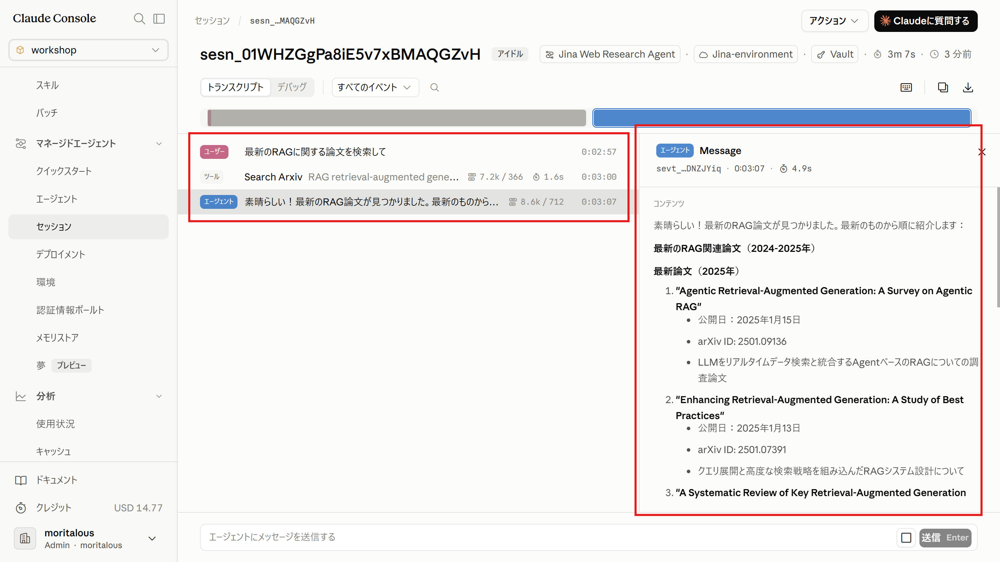

作成する要素は次の4つです。

| 要素 | 役割 |
|------|------|
| 認証情報ボールト | Jina AIのAPIキーを安全に保管する仕組み |
| 環境 | MCPサーバーへのネットワークアクセスを許可する実行環境 |
| エージェント | Jina AIのツールを使うリサーチエージェント本体 |
| セッション | ボールト・環境・エージェントを組み合わせて起動する実行単位 |

## Jina AIとは

[Jina AI](https://jina.ai/)は、Web検索やページ読み取りなど、LLM向けの検索基盤APIを提供しているサービスです。公式のリモートMCPサーバー（`https://mcp.jina.ai/v1`、リポジトリ: [jina-ai/MCP](https://github.com/jina-ai/MCP)）が公開されており、エージェントから次のようなツールを呼び出せます。

- `search_web`・・・Web全体を検索
- `search_arxiv` / `search_ssrn`・・・学術論文を検索
- `read_url`・・・WebページをMarkdownとして読み取り
- `parallel_read_url`・・・複数のURLを並列で読み取り

このほか画像検索やPDF抽出なども含め、約20種類のツールが提供されています。APIキーはクレジットカード登録なしで無料発行でき、無料トークン枠の範囲でこのハンズオンを進められます。

## 1. Jina AIのAPIキーを取得

<Steps>
1. https://jina.ai/ にアクセスします。

1. 画面中程までスクロールし、「API KEY & BILLING」タブをクリックします。コピーアイコンをクリックしてAPIキーをコピーします。

    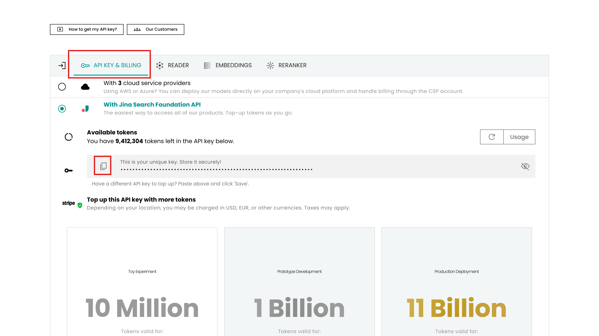

</Steps>

## 2. 認証情報ボールトを作成

まず、認証情報ボールトを作成します。認証情報ボールトとは、外部サービスのAPIキーやトークンといった認証情報を安全に保管しておく仕組みです。セッション作成時にボールトを指定すると、エージェントがMCPサーバーに接続する際にその認証情報が使われます。システムプロンプトや会話にAPIキーを直接書かずに済むのがポイントです。

<Steps>

1. 「認証情報ボールト」メニューを選択します。「ボールトを作成する」をクリックします。

    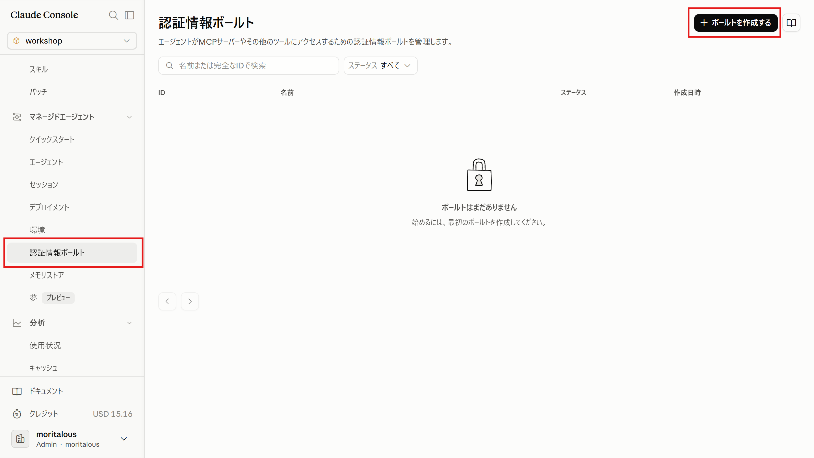

1. ボールトの名前として「Vault」を入力し、「続ける」をクリックします。

    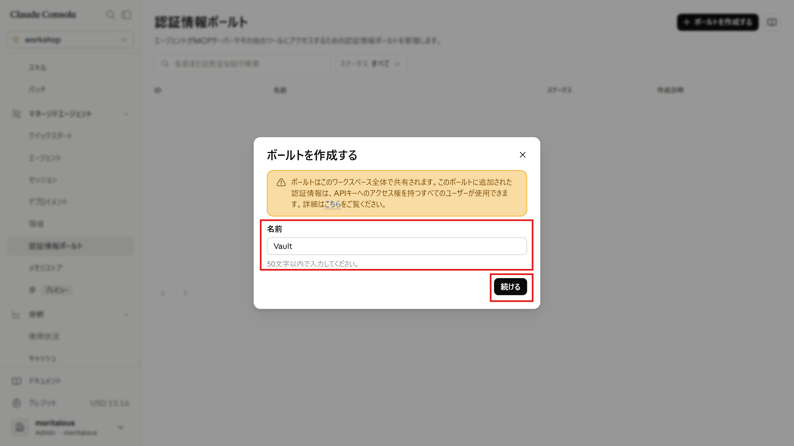

    <Aside type="caution">
    認証情報ボールトは、ワークスペース内で共有されます。
    </Aside>

1. 続けて認証情報を追加します。
    名前に「Jina-ai」と入力し、タイプは「Bearerトークン」を選択します。

    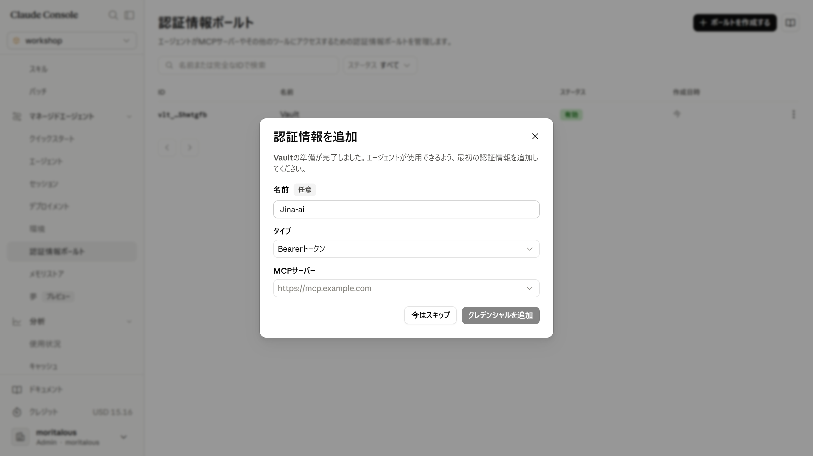

1. MCPサーバーをクリックし、カスタムURL入力欄に「`https://mcp.jina.ai/v1`」と入力します。

    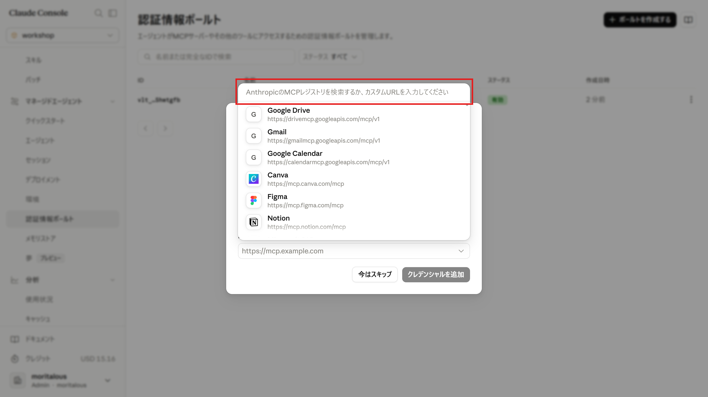

1. 「カスタムサーバー」をクリックします。

    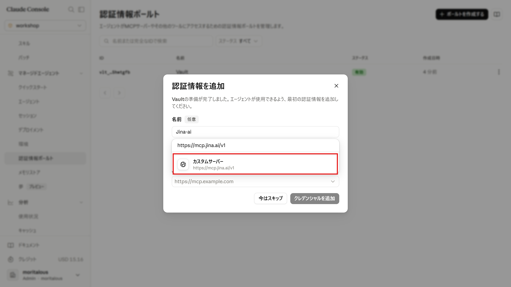

1. トークンにJina AIのAPIキーを入力します。認証情報に関する注意事項に同意（チェック）し、「クレデンシャルを追加」をクリックします。

    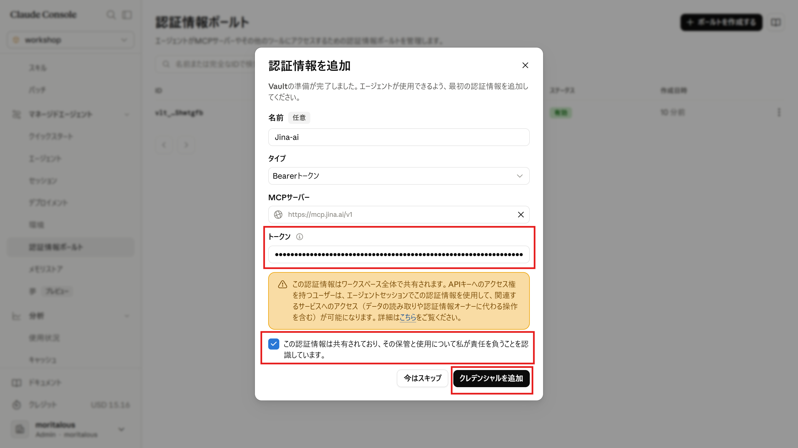

</Steps>

## 3. 環境を作成

<Steps>

1. 「環境」メニューを選択します。「環境を作成」をクリックします。

    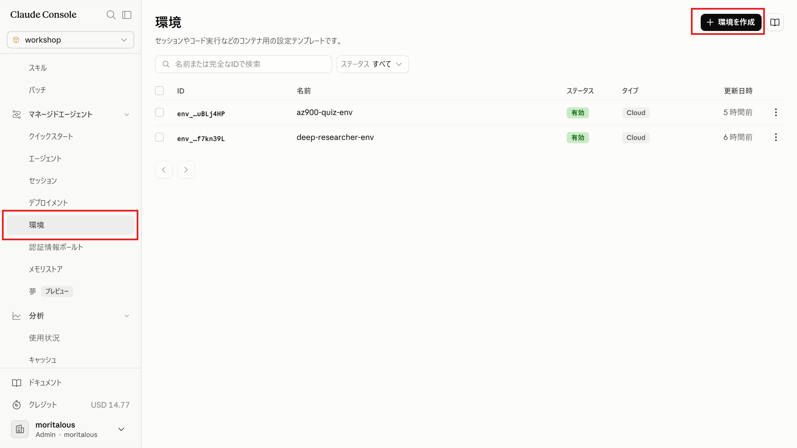

1. 名前に「Jina-environment」と入力し、「作成」をクリックします。

    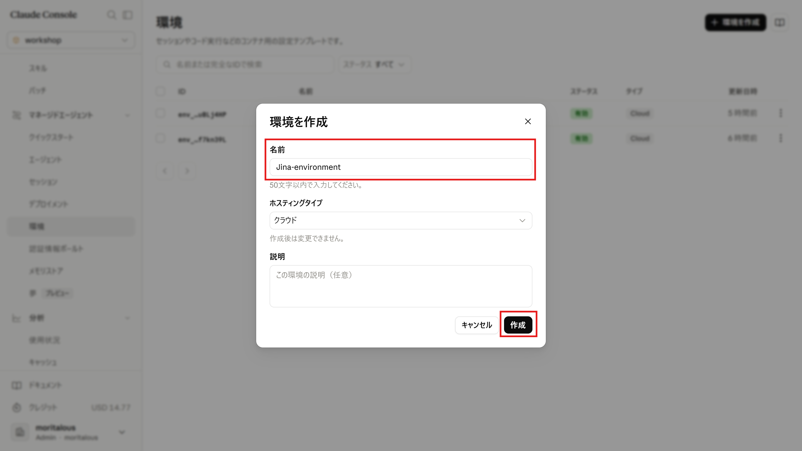

1. 「編集」をクリックします。

    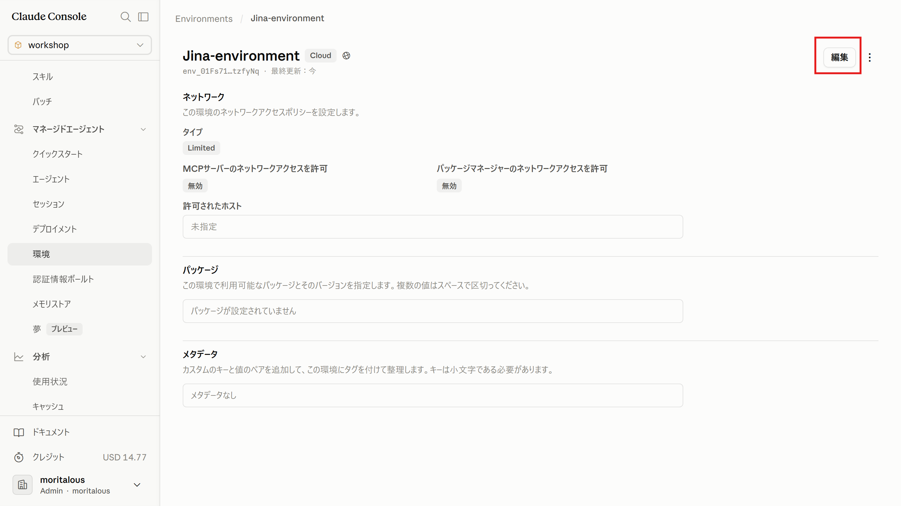

1. 「MCPサーバーのネットワークアクセスを許可」にチェックを入れ「変更を保存」をクリックします。

    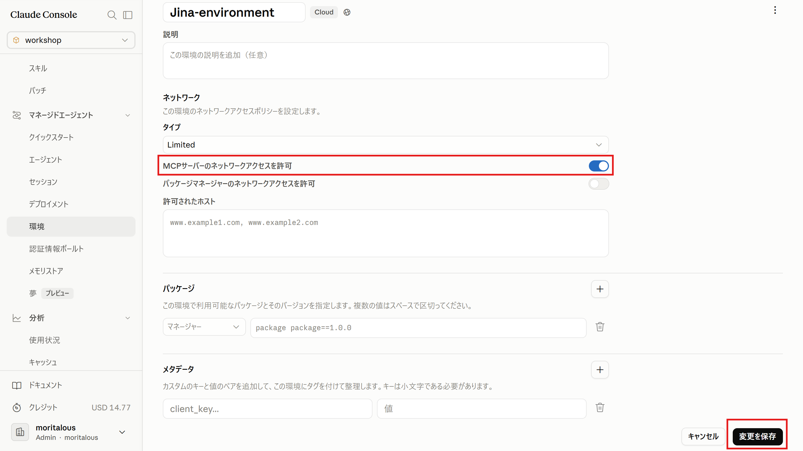

</Steps>

## 4. エージェントを作成

<Steps>

1. 「エージェント」メニューを選択します。「エージェントを作成する」をクリックします。

    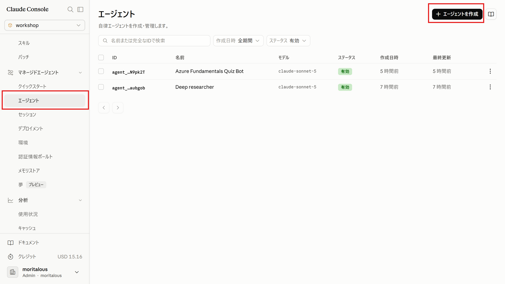

1. エージェント設定の入力欄に以下のYAMLを入力し、「エージェントを作成」をクリックします。

    ```yaml
    name: Jina Web Research Agent
    model:
      id: claude-haiku-4-5
      speed: standard
    description: Jina AIのMCPサーバーを使ったWeb検索、ページ読み取り、学術研究のデモエージェント。
    system: あなたはJina AIの検索・読み取りツールを活用するリサーチアシスタントです。質問を受けたら、search_web（学術的なトピックの場合はsearch_arxivやsearch_ssrn）を使って関連ソースを見つけ、その後read_urlまたはparallel_read_urlを使って、有望な結果の全文を取得してください。検索結果のスニペットだけに頼らないようにしてください。複数のソースから得た情報を組み合わせ、使用したURLを引用し、不確実な点や矛盾する情報がある場合は明確に示してください。効率化のため、複数のソースを同時に検索・読み取る際はparallel_*系のツールを優先して使ってください。特定のページの要約や事実抽出を求められた場合は、read_urlで直接そのページを読み取ってください。回答は簡潔かつ整理された形にし、事前知識ではなく取得したコンテンツに基づくようにしてください。
    mcp_servers:
      - name: jina
        type: url
        url: https://mcp.jina.ai/v1
    tools:
      - configs: []
        default_config:
          enabled: true
          permission_policy:
            type: always_allow
        mcp_server_name: jina
        type: mcp_toolset
    skills: []
    metadata: {}
    ```

</Steps>

## 5. セッションを作成

<Steps>

1. 「セッション」メニューを選択します。「セッションを作成」をクリックします。

    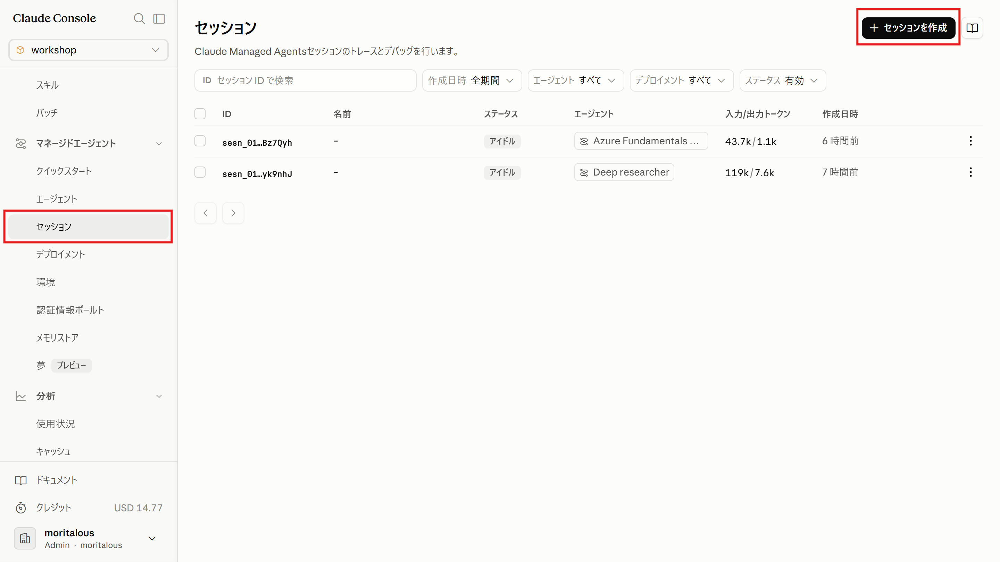


1. エージェントを「Jina Web Research Agent」、環境を「Jina-environment」、認証情報ボールトを「Vault」、注意書きにチェックを入れます。「セッションを作成」をクリックします。

    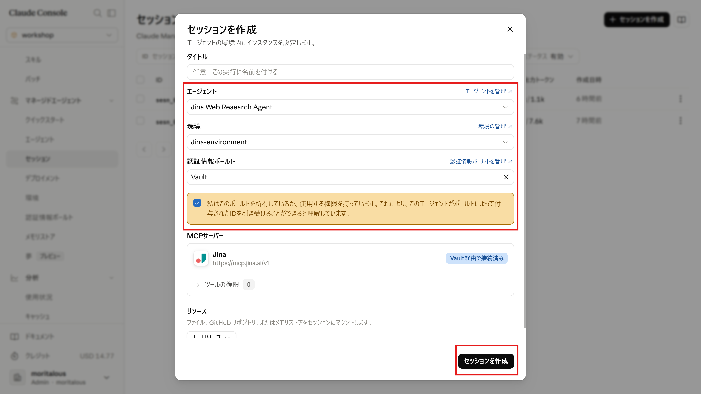

</Steps>


## 6. エージェントを呼び出す

<Steps>

1. チャット欄に「最新のRAGに関する論文を検索して」などを入力し、送信します。

    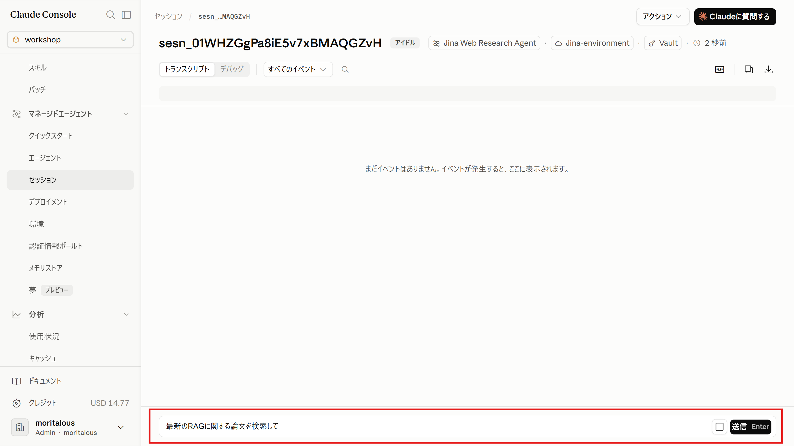

1. MCPサーバーを使って情報を取得し、回答が返ってきます。

    

</Steps>

## まとめ

- APIキーのような秘密情報は**認証情報ボールト**に保管し、セッション作成時に紐付けます。システムプロンプトや会話にキーを書かずに済みます。
- MCPサーバーを使うには、①ボールトに認証情報(接続先URL単位)、②環境でMCPサーバーへのネットワークアクセス許可、③エージェントに`mcp_servers`と`mcp_toolset`の定義、の3点が必要です。
- **環境・エージェント・セッション（必要な場合はボールト）**という部品の組み立てが、Managed Agentsの基本形です。次のページからは、同じ構成をCLIとSDKで作ります。

<ShareOnX />
