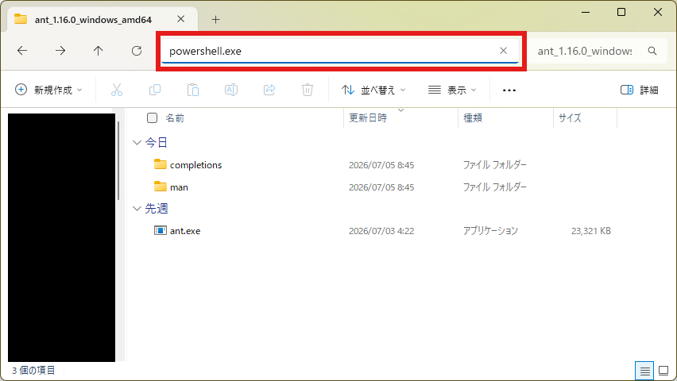
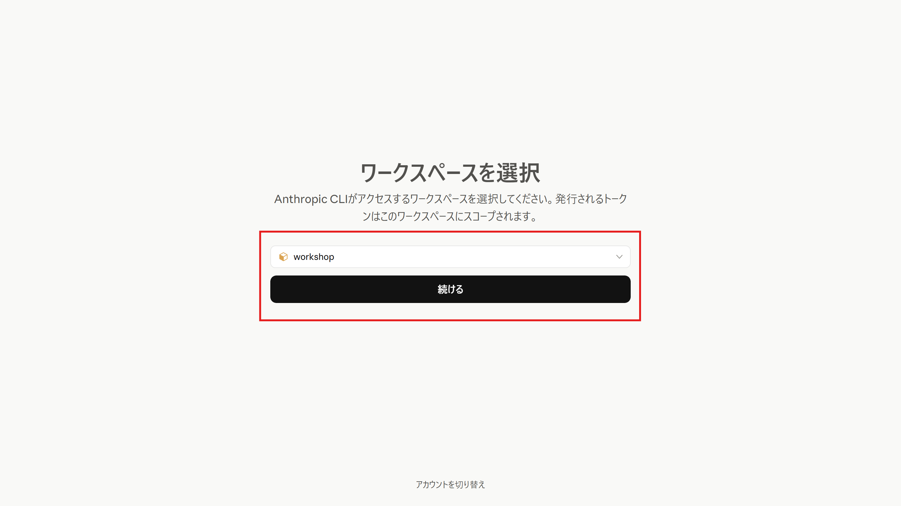

import { Steps, Tabs, TabItem, Aside } from '@astrojs/starlight/components';
import ShareOnX from '../../../components/ShareOnX.astro';

`ant`というClaude Platform CLIを使ってエージェントを作成します。

<Aside>
このページで使うコマンドは、`ant beta:agents create`のようにすべて`beta:`から始まります。Managed AgentsのAPIは現在**ベータ版**として提供されており、`ant`ではベータ版のAPIが`beta:`プレフィックス付きのコマンドとして区別されています。ベータ版APIの呼び出しには本来`anthropic-beta: managed-agents-2026-04-01`というHTTPヘッダーの指定が必要ですが、`beta:`付きのコマンドを使うことがその指定にあたり、対応するヘッダーはCLIが送信してくれます。
</Aside>

## 1. antの環境をセットアップ

<Steps>

1. antをインストールします。

    <Tabs syncKey="os">

    <TabItem label="Windows">
    1. `ant`の[リリースページ](https://github.com/anthropics/anthropic-cli/releases/latest)より、`ant_{バージョン番号}_windows_amd64.zip`をダウンロードします。
        
    1. 任意の場所に展開します。
    1. 展開したフォルダーで`powershell.exe`を起動します。

        :::note
        ファイルパスが表示されているエリアに入力するのが手っ取り早いと思います。

        
        :::
    1. コマンド出力の日本語が文字化けしないよう、文字コードをUTF-8に設定します。

        ```shell
        $OutputEncoding = [Console]::OutputEncoding = New-Object System.Text.UTF8Encoding $false
        ```

        :::note
        この設定はウィンドウごとに必要です。PowerShellを開き直したときは、再度実行してください。
        :::
    </TabItem>

    <TabItem label="macOS">

    1. ターミナルを開き、以下のコマンドを実行します。
        ```shell
        brew install anthropics/tap/ant
        ```
    </TabItem>

    </Tabs>

1. `ant auth login`を実行します。

    <Tabs syncKey="os">

    <TabItem label="Windows">
    1. 以下のコマンドを実行します。
        ```shell
        ./ant auth login
        ```
    </TabItem>

    <TabItem label="macOS">

    1. 以下のコマンドを実行します。
        ```shell
        ant auth login
        ```
    </TabItem>

    </Tabs>

1. ブラウザでログインします。

    

    :::note
    ブラウザで自動的にログイン処理が行われない場合は、ターミナルに出力されたURLにアクセスして手順に沿ってログインしてください。
    :::

</Steps>


## 2. 認証情報ボールトを作成

ここからは、[1. コンソールでエージェントを作成](/intermediate/01_console/)で画面から作った構成(認証情報ボールト → 環境 → エージェント → セッション)と同じものを、すべて`ant`コマンドで作成します。コンソール版と名前が重複しないよう、CLI版の名前には「-cli」を付けています。

<Aside>
コマンドは、Windowsは`ant`を展開したフォルダーのPowerShellで、macOSはターミナルで実行します。`$VAULT_ID`のような変数はウィンドウを閉じると消えるので、以降の手順は同じウィンドウで続けて実行してください。
</Aside>

<Steps>

1. ボールトを作成し、IDを変数に保存します。

    <Tabs syncKey="os">

    <TabItem label="Windows">
    ```shell
    $VAULT_ID = ./ant beta:vaults create --display-name "Vault-cli" --transform id --raw-output
    ```
    </TabItem>

    <TabItem label="macOS">
    ```shell
    VAULT_ID=$(ant beta:vaults create --display-name "Vault-cli" --transform id --raw-output)
    ```
    </TabItem>

    </Tabs>

    変数の中身を表示して、`vlt_`で始まるIDが保存されていることを確認します。

    <Tabs syncKey="os">

    <TabItem label="Windows">
    ```shell
    $VAULT_ID
    ```
    </TabItem>

    <TabItem label="macOS">
    ```shell
    echo "$VAULT_ID"
    ```
    </TabItem>

    </Tabs>

1. ボールトにJina AIのAPIキーを認証情報として追加します。`ここにAPIキー`の部分を実際のAPIキーに置き換えてから実行してください(コマンドは1行です)。

    <Tabs syncKey="os">

    <TabItem label="Windows">
    ```shell
    ./ant beta:vaults:credentials create --vault-id $VAULT_ID --display-name "Jina-ai-cli" --auth '{type: static_bearer, mcp_server_url: https://mcp.jina.ai/v1, token: ここにAPIキー}'
    ```
    </TabItem>

    <TabItem label="macOS">
    ```shell
    ant beta:vaults:credentials create --vault-id "$VAULT_ID" --display-name "Jina-ai-cli" --auth '{type: static_bearer, mcp_server_url: https://mcp.jina.ai/v1, token: ここにAPIキー}'
    ```
    </TabItem>

    </Tabs>

    <Aside>
    APIキーは[1. コンソールでエージェントを作成](/intermediate/01_console/)で取得したものと同じで構いません(コンソールの「Bearerトークン」に相当するのが`static_bearer`です)。
    </Aside>

</Steps>

## 3. 環境を作成

<Steps>

1. MCPサーバーへのネットワークアクセスを許可した環境を作成し、IDを変数に保存します(コマンドは1行です)。

    <Tabs syncKey="os">

    <TabItem label="Windows">
    ```shell
    $ENVIRONMENT_ID = ./ant beta:environments create --name "Jina-environment-cli" --config '{type: cloud, networking: {type: limited, allow_mcp_servers: true}}' --transform id --raw-output
    ```
    </TabItem>

    <TabItem label="macOS">
    ```shell
    ENVIRONMENT_ID=$(ant beta:environments create --name "Jina-environment-cli" --config '{type: cloud, networking: {type: limited, allow_mcp_servers: true}}' --transform id --raw-output)
    ```
    </TabItem>

    </Tabs>

    <Aside>
    `allow_mcp_servers: true`が、コンソールの「MCPサーバーのネットワークアクセスを許可」チェックに相当します。
    </Aside>

    変数の中身を表示して、`env_`で始まるIDが保存されていることを確認します。

    <Tabs syncKey="os">

    <TabItem label="Windows">
    ```shell
    $ENVIRONMENT_ID
    ```
    </TabItem>

    <TabItem label="macOS">
    ```shell
    echo "$ENVIRONMENT_ID"
    ```
    </TabItem>

    </Tabs>

</Steps>

## 4. エージェントを作成

<Steps>

1. コマンドを実行しているフォルダーに`agent.yaml`という名前のファイルを作成し、以下の内容を保存します。

    <Aside type="caution">
    文字コードは「UTF-8」です(メモ帳の既定でOKですが、「UTF-8 (BOM付き)」は選ばないでください)。エージェント名以外は、コンソールで作成したものと同じ設定です。
    </Aside>

    ```yaml title="agent.yaml"
    name: Jina Web Research Agent CLI
    model:
      id: claude-haiku-4-5
      speed: standard
    description: Jina AIのMCPサーバーを使ったWeb検索、ページ読み取り、学術研究のデモエージェント。
    system: あなたはJina AIの検索・読み取りツールを活用するリサーチアシスタントです。質問を受けたら、search_web（学術的なトピックの場合はsearch_arxivやsearch_ssrn）を使って関連ソースを見つけ、その後read_urlまたはparallel_read_urlを使って、有望な結果の全文を取得してください。検索結果のスニペットだけに頼らないようにしてください。複数のソースから得た情報を組み合わせ、使用したURLを引用し、不確実な点や矛盾する情報がある場合は明確に示してください。効率化のため、複数のソースを同時に検索・読み取る際はparallel_*系のツールを優先して使ってください。特定のページの要約や事実抽出を求められた場合は、read_urlで直接そのページを読み取ってください。回答は簡潔かつ整理された形にし、事前知識ではなく取得したコンテンツに基づくようにしてください。
    mcp_servers:
      - name: jina
        type: url
        url: https://mcp.jina.ai/v1
    tools:
      - type: mcp_toolset
        mcp_server_name: jina
        default_config:
          enabled: true
          permission_policy:
            type: always_allow
    skills: []
    metadata: {}
    ```

1. `agent.yaml`を読み込ませてエージェントを作成し、IDを変数に保存します。

    <Tabs syncKey="os">

    <TabItem label="Windows">
    ```shell
    $AGENT_ID = Get-Content agent.yaml -Raw -Encoding UTF8 | ./ant beta:agents create --transform id --raw-output
    ```
    </TabItem>

    <TabItem label="macOS">
    ```shell
    AGENT_ID=$(ant beta:agents create --transform id --raw-output < agent.yaml)
    ```
    </TabItem>

    </Tabs>

    <Aside type="caution">
    Windowsで日本語が「?」に化けて登録されてしまった場合は、[1. antの環境をセットアップ](#1-antの環境をセットアップ)の文字コード設定を実行し忘れています。設定を実行してから、`Get-Content agent.yaml -Raw -Encoding UTF8 | ./ant beta:agents update --agent-id $AGENT_ID --version 1`で上書きできます。
    </Aside>

    変数の中身を表示して、`agent_`で始まるIDが保存されていることを確認します。

    <Tabs syncKey="os">

    <TabItem label="Windows">
    ```shell
    $AGENT_ID
    ```
    </TabItem>

    <TabItem label="macOS">
    ```shell
    echo "$AGENT_ID"
    ```
    </TabItem>

    </Tabs>

</Steps>

## 5. セッションを作成

<Steps>

1. ここまでで保存した3つのIDが揃っていることを確認します。

    <Tabs syncKey="os">

    <TabItem label="Windows">
    ```shell
    $AGENT_ID; $ENVIRONMENT_ID; $VAULT_ID
    ```
    </TabItem>

    <TabItem label="macOS">
    ```shell
    echo "$AGENT_ID"; echo "$ENVIRONMENT_ID"; echo "$VAULT_ID"
    ```
    </TabItem>

    </Tabs>

    <Aside type="caution">
    `agent_...`、`env_...`、`vlt_...`の3行が表示されない場合は、空になっている変数を作った手順に戻ってやり直してください。変数が空のまま次のコマンドを実行すると、引数がずれて「Unexpected extra arguments」のようなエラーになります。
    </Aside>

1. エージェント・環境・ボールトのIDを指定してセッションを作成し、IDを変数に保存します(コマンドは1行です)。

    <Tabs syncKey="os">

    <TabItem label="Windows">
    ```shell
    $SESSION_ID = ./ant beta:sessions create --agent $AGENT_ID --environment-id $ENVIRONMENT_ID --vault-id $VAULT_ID --transform id --raw-output
    ```
    </TabItem>

    <TabItem label="macOS">
    ```shell
    SESSION_ID=$(ant beta:sessions create --agent "$AGENT_ID" --environment-id "$ENVIRONMENT_ID" --vault-id "$VAULT_ID" --transform id --raw-output)
    ```
    </TabItem>

    </Tabs>

    変数の中身を表示して、`sesn_`で始まるIDが保存されていることを確認します。

    <Tabs syncKey="os">

    <TabItem label="Windows">
    ```shell
    $SESSION_ID
    ```
    </TabItem>

    <TabItem label="macOS">
    ```shell
    echo "$SESSION_ID"
    ```
    </TabItem>

    </Tabs>

    <Aside>
    ここまでに作成したボールト・環境・エージェント・セッションは、コンソールのそれぞれのメニューにも表示されます。
    </Aside>

</Steps>

## 6. エージェントを呼び出す

<Steps>

1. ターミナルを2つ使い、片方でイベントをリアルタイムに受信しながら、もう片方からメッセージを送信します。まず、これまで使ってきたウィンドウ(**ターミナル1**)でイベントのストリーム受信を開始します。

    <Tabs syncKey="os">

    <TabItem label="Windows">
    ```shell
    ./ant beta:sessions:events stream --session-id $SESSION_ID --format jsonl
    ```
    </TabItem>

    <TabItem label="macOS">
    ```shell
    ant beta:sessions:events stream --session-id "$SESSION_ID" --format jsonl
    ```
    </TabItem>

    </Tabs>

    コマンドは実行したまま、イベントが届くのを待ち受けます。`--format jsonl`を付けているので、イベントは1行ずつJSON形式で表示されます。

1. 新しいウィンドウ(**ターミナル2**)を開き、送信の準備をします。変数はウィンドウごとに独立しているため、ターミナル2にも`$SESSION_ID`を設定します。`ここにセッションID`の部分は、[5. セッションを作成](#5-セッションを作成)で表示した`sesn_`から始まるIDに置き換えてください(ターミナル1の画面をさかのぼると確認できます)。

    <Tabs syncKey="os">

    <TabItem label="Windows">
    `ant`を展開したフォルダーで新しくPowerShellを起動し、以下を実行します。

    ```shell
    $OutputEncoding = [Console]::OutputEncoding = New-Object System.Text.UTF8Encoding $false
    $SESSION_ID = "ここにセッションID"
    ```
    </TabItem>

    <TabItem label="macOS">
    新しくターミナルを開き、以下を実行します。

    ```shell
    SESSION_ID="ここにセッションID"
    ```
    </TabItem>

    </Tabs>

1. ターミナル2からメッセージを送信します(コマンドは1行です)。

    <Tabs syncKey="os">

    <TabItem label="Windows">
    ```shell
    ./ant beta:sessions:events send --session-id $SESSION_ID --event '{type: user.message, content: [{type: text, text: "最新のRAGに関する論文を検索して"}]}'
    ```
    </TabItem>

    <TabItem label="macOS">
    ```shell
    ant beta:sessions:events send --session-id "$SESSION_ID" --event '{type: user.message, content: [{type: text, text: "最新のRAGに関する論文を検索して"}]}'
    ```
    </TabItem>

    </Tabs>

    送信すると、ターミナル1に`user.message`をはじめとするイベントが流れ始めます。MCPツールの呼び出し（`agent.mcp_tool_use`）に続いて、`agent.message`イベントの`text`として回答が届きます。`session.status_idle`が表示されたら完了です。

    回答を確認できたら、ターミナル1で`Ctrl+C`を押してストリームを終了してください。

    表示を見逃した場合は、イベント履歴から確認できます。イベントが1行ずつ表示され、`agent.message`の行の`text`が回答です。

    <Tabs syncKey="os">

    <TabItem label="Windows">
    ```shell
    ./ant --format jsonl --transform '{type,text:content.0.text}' beta:sessions:events list --session-id $SESSION_ID
    ```
    </TabItem>

    <TabItem label="macOS">
    ```shell
    ant --format jsonl --transform '{type,text:content.0.text}' beta:sessions:events list --session-id "$SESSION_ID"
    ```
    </TabItem>

    </Tabs>

1. コンソールの「セッション」メニューから同じセッションを開くと、画面上でもやり取りを確認できます。

</Steps>

## まとめ

- コンソールで作ったものと同じ構成(ボールト → 環境 → エージェント → セッション)を、`ant`コマンドだけで再現しました。
- ベータ版APIは`beta:`プレフィックスのコマンドで呼び出します。`--transform id --raw-output`でレスポンスからIDだけを取り出し、変数で次のコマンドに受け渡しました。
- 設定は1行のフラグ(`--auth`や`--event`)でも、YAMLファイル(`agent.yaml`)でも渡せます。
- セッションとのやり取りは、`events send`で送信し、`events stream`(または履歴の取得)で確認します。

<ShareOnX />
